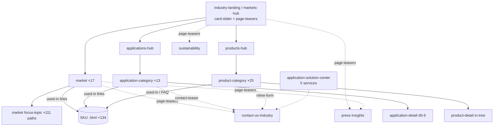

# Tesa Industry — Content Model Analysis

> Reverse-engineered IA only — this documents the **structure** (templates, module sequences, CTA/download/resource patterns) of `tesa.com/en/industry`, not Tesa's copy or code. Grounded entirely in the crawl: `data/inventory.json` (313 paths), `data/pages.json` (60 deep-extracted pages), `data/nav.json`, cross-referenced with `tesa-sitemap.md`. Every module sequence, H2, CTA and download below is quoted from the crawled JSON.
>
> **Scope/provenance:** the **313-path inventory is the `/en/industry` subtree only** — it contains *no* `/en/about-tesa` paths. The three **corporate** templates documented below (Sustainability, Press & Insights, Careers) are sourced from **3 additional deep-extracted `/en/about-tesa` pages** plus `nav.json` (their hubs are linked from the industry top nav/footer), not from the 313 count.

---

## 1. How to read this report

Tesa Industry is **not** a set of hand-built pages. It is a small library of **page templates**, each composed by stacking a fixed sequence of **modules** (Tesa's design-system components: `static-stage`, `headline-module`, `anchor-page-navigation`, `paragraph-2022`, `contact-teaser`, `inline-form`, `downloads`, `faq`, `page-teasers`, …). The same module appears across many templates in a predictable order. This report documents, for **every** template:

- **Template name** + which paths use it + depth
- **Section order** — the ordered module sequence (`moduleSeq` from `pages.json`), expressed both as Tesa modules and as a plain-English section flow
- **Recurring modules** present
- **CTA patterns** (`ctas[]`)
- **Downloads patterns** (`downloads[]` / `downloadCount`)
- **Resource patterns** (embedded PDFs, cross-links, related teasers)
- **Real H2 examples** (`h2[]`)

There is **no** dedicated "Technologies" or "Resources/Downloads" top-level section. Technologies are implicit in product categories / adhesive types; downloads/resources are **embedded** via the `downloads` module on product, market and SKU pages; "insights/knowledge" lives in the corporate **Press & Insights** feeds.

### Section / template map (one line each)

```
/en/industry ................................. industry-landing  (= markets-hub)
/en/industry/markets ......................... markets-hub  (identical clone of landing)
/en/industry/markets/<market> ................ market  (17)
/en/industry/markets/<market>/<focus> ........ market focus-topic  (segment / d5+)
/en/industry/applications .................... applications-hub
/en/industry/applications/<cat> .............. application-category  (13)
/en/industry/applications/<cat>/<detail> ..... application-detail  (d5–6)
/en/industry/products ........................ products-hub
/en/industry/products/<cat> .................. product-category  (25)
/en/industry/products/<cat>/<detail> ......... product-detail (in-tree)
/en/industry/<sku>.html ...................... product-detail / SKU  (134, flat)
/en/industry/contact-us-industry ............. contact
/en/industry/application-solution-center ..... application-solution-center
/en/about-tesa/sustainability ................ sustainability  (corporate)
/en/about-tesa/press-insights ................ press-insights  (corporate)
/en/about-tesa/career ........................ career  (corporate)
```

---

## 2. Hub & landing templates

### 2.1 `industry-landing` (= `markets-hub`)

- **Paths:** `/en/industry` (depth 2, root) **and** `/en/industry/markets` (depth 3) — byte-identical module sequence, H2s, CTAs and links. The markets hub is literally a clone of the industry landing.
- **Section order (moduleSeq):**

  | # | Module | Section role |
  |---|---|---|
  | 1 | `static-activation-stage` | Hero (animated/activation variant) |
  | 2 | `card-slider` | "Select your market" market picker carousel |
  | 3 | `highlight-teasers` | "Benefits of partnering with us" |
  | 4 | `contact-teaser` | Contact CTA block ("Find your contact") |
  | 5 | `page-teasers` | "Discover more" lateral cross-links |

  Plain flow: **Hero → Market picker → Partnering benefits → Contact CTA → Discover more.**
- **H2 examples:** "Select your market", "Benefits of partnering with us", "Discover more".
- **CTA patterns:** `Find out more`, `Learn more`, `Find your contact`, `Get in touch`.
- **Downloads:** none (`downloadCount: 0`).
- **Resource patterns:** pure routing surface. `card-slider` links to all 17 markets + `application-solution-center`; `page-teasers` cross-links to corporate (`/sustainability/products-and-packaging`, `/product-and-technology-development`, `/locations-subsidiaries`) and to Press & Insights stories. Also surfaces one product-detail deep-link (`/products/double-sided-tapes/team-4965-assortment`).

### 2.2 `applications-hub`

- **Path:** `/en/industry/applications` (depth 3). H1: "Adhesives applications for industry".
- **Section order (moduleSeq):** `static-stage` → `anchor-page-navigation` → `headline-module` → `page-teasers` → `paragraph-2022` → `marg-t--component` → `contact-teaser`.
  Plain flow: **Hero → Anchor jump-nav → Section header → Category teasers → Rich text → spacing → Contact CTA.**
- **H2 examples:** "Find the right adhesive tape based on your application", "Find the right adhesive tape for your industrial application".
- **CTA patterns:** `Contact`, `Get in touch`.
- **Downloads:** none.
- **Resource patterns:** `page-teasers` route to the 13 application categories (and to `/products`, `/contact-us-industry`). Differs from markets-hub: uses `static-stage` + `anchor-page-navigation` + `page-teasers` instead of `card-slider`.

### 2.3 `products-hub`

- **Path:** `/en/industry/products` (depth 3). H1: "Industrial adhesive products".
- **Section order (moduleSeq):** `static-stage` → `headline-module` → `page-teasers` → `paragraph-2022` → `marg-t--component` → `contact-teaser`.
  Plain flow: **Hero → Section header → Product-category teasers → Rich text → spacing → Contact CTA.**
- **H2 examples:** "Your partner for industrial adhesives", "Find the right adhesive tape type for your application", "Product overview".
- **CTA patterns:** `Get in touch`.
- **Downloads:** none.
- **Resource patterns:** `page-teasers` route to the product categories. (There are **25 depth-4 paths** under `/products`, of which **24 are true product categories + 1 is the `products-finder` tool** — an interactive selector, not a category page.) No `anchor-page-navigation` (unlike applications-hub).

> **Hub family pattern:** all three hubs = Hero → (picker/teasers) → rich text → contact-teaser. Landing/markets use `card-slider`; applications/products use `page-teasers`. Only applications-hub carries the `anchor-page-navigation`.

---

## 3. Market templates

### 3.1 `market` (the 17 market pages)

- **Paths (17, depth 4):** `appliances`, `automotive`, `battery-energy-storage-systems`, `building-industry`, `distribution-partners`, `electronics`, `food-industry`, `health-markets`, `industrial-converter-partners`, `metal-industry`, `paper-print`, `server-and-data-centre`, `smart-cards`, `solar-industry`, `transportation-industry`, `wind-energy`, `wire-harnessing`.
- **Canonical section order.** Most markets follow a content-led variant: `static-stage` → `anchor-page-navigation` → `paragraph-2022`(×n) → [content modules] → `marg-t--component` → `inline-form` → `downloads` → `faq`. The brief's idealized order (`static-stage → headline-module → image-with-caption → highlight-teasers → headline-module → image-article-teasers → headline-module → inline-form → downloads`) matches the **`appliances`** page exactly:

  | # | Module (appliances) | Section role |
  |---|---|---|
  | 1 | `static-stage` | Hero |
  | 2 | `headline-module` | "For every appliance" |
  | 3 | `image-with-caption` | Lead image + caption |
  | 4 | `highlight-teasers` | "Your goals are our goals" (Innovation / Collaboration / Sustainability) |
  | 5 | `headline-module` | section header |
  | 6 | `image-article-teasers` | Story teasers |
  | 7 | `headline-module` | "Get in touch" |
  | 8 | `inline-form` | Embedded contact form |
  | 9 | `downloads` | Assortment folder |

  Plain flow: **Hero → Intro → Lead image → Goals/benefit teasers → Stories → Contact form → Downloads.**
- **Variation across the 17 (all real, from `pages.json`):**
  - **Goal/benefit framing** "Your goals are our goals" → **Innovation / Collaboration / Sustainability** appears as `highlight-teasers` (appliances) or as focus-topic child pages.
  - Most markets (`automotive`, `battery-energy-storage-systems`, `building-industry`, `electronics`, `food-industry`, `health-markets`, `metal-industry`, `server-and-data-centre`, `smart-cards`, `solar-industry`, `transportation-industry`, `wind-energy`, `wire-harnessing`) open with `static-stage` → `anchor-page-navigation` → `paragraph-2022` and use `tip-steps` (numbered application steps) + `inline-form`.
  - **`faq`** present on `battery-energy-storage-systems`, `building-industry`, `server-and-data-centre`, `transportation-industry`.
  - **`image-map` / `image-text-stacked`** used for application diagrams (`electronics`, `server-and-data-centre`, `wind-energy`, `wire-harnessing`).
  - Partner-style markets (`distribution-partners`, `industrial-converter-partners`) break the mold — see §3.3.
  - **`paper-print`** is a sub-hub (see §3.4).
- **H2 examples:** "For every appliance", "Your goals are our goals", "Get in touch", "Let's go together" (appliances); "Key application areas in the automotive industry", "Our portfolio of automotive adhesive solutions" (automotive); "Your reliable tape partner for battery energy storage solutions", "FAQs" (BESS); "Discover our tape assortment for industrial food packaging", "Didn't find what you were looking for?" (food).
- **CTA patterns:** `Contact` / `Contact us`, `Downloads`, `Get in touch`. (appliances has empty `ctas[]` — its CTAs are inside `inline-form`/`downloads`.)
- **Downloads patterns:** **typically 1 market assortment folder** (the brief's "1 download" holds for most): appliances 1 ("Adhesive tape solutions for the appliance industry"), electronics 1, food 1, metal 1, server 1, solar 1, wind 1, wire-harnessing 1. Some carry more: `battery-energy-storage-systems` 2, `smart-cards` 3. A few carry none (`automotive` 0, `building-industry` 0, `transportation-industry` 0, `health-markets` 0) and rely on `inline-form` only.
- **Resource patterns:** markets are the primary **"used-in" bridge** — `links[]` point to (a) individual SKU `.html` pages (e.g. food-industry → `tesa-6081.html`, `tesa-4917.html`, …; BESS → `tesa-58352.html`, `tesa-61024-cell-wrapping.html`; server → 18 SKUs), (b) related markets/applications (automotive → `markets/wire-harnessing`; transportation → `applications/bundling`), and (c) corporate stories. Downloads are full marketing PDFs served from `/en/files/download/...`.

### 3.2 `market focus-topic` (segment / sub-market, depth 5+)

- **Paths:** focus/segment children under markets, e.g. `markets/appliances/collaboration`, `markets/appliances/commercial-appliances`, `markets/automotive/ev-battery`, `markets/electronics/smartphone`, `markets/solar-industry/wafer-based-solar-modules`, `markets/wire-harnessing/basic-bundling`. 111 paths total live under `markets` (depth 3–8).
- **Section order (from `appliances/collaboration`, moduleSeq):** `static-stage` → `headline-module` → `tip-steps` → `image-with-caption` → `headline-module` → `image-text-stacked` → `paragraph-2022` → `blue-headline` → `inline-form` → `downloads` → `page-teasers`.
  And from `appliances/commercial-appliances`: `static-stage` → `anchor-page-navigation` → `headline-module` → `paragraph` → `tip-steps`(×3) → `inline-form` → `paragraph` → `blue-headline` → `marg-t--component` → `downloads` → `page-teasers`.
  Plain flow: **Hero → (anchor-nav) → Header → Step list (`tip-steps`) → image+text → Contact form → Downloads → Sibling focus-topics (`page-teasers`).**
  This matches the brief's focus-topic spec: `static-stage → headline-module → tip-steps → image-with-caption → image-text-stacked → inline-form → downloads → page-teasers`.
- **H2 examples:** "Our offer when it comes to adhesive challenges", "Take a look at how we work at our Customer Solution Centers", "Let's go together", "Take a look at our other main focus topics for appliances:" (collaboration); "Tape application areas for commercial appliances", "Looking for something specific?" (commercial-appliances).
- **CTA patterns:** `Downloads`, `Get in touch`.
- **Downloads:** usually inherits the parent market's assortment folder (collaboration & commercial-appliances both → "Adhesive tape solutions for the appliance industry", 1 download).
- **Resource patterns:** `page-teasers` cross-link **sibling focus-topics** ("other main focus topics for appliances": innovation / collaboration / sustainability) — strong lateral discovery within a market. Some leaf focus-topics are thin **product-list landings** (see §3.5).

### 3.3 Partner-market variant (`distribution-partners`, `industrial-converter-partners`)

These two markets use a distinct, teaser-heavy template (program/partner marketing, not application content):
- **`distribution-partners` moduleSeq:** `static-stage` → `headline-module` → `highlight-teasers` → `article-gallery-growth`(×2) → `paragraph` → `blue-headline` → `paragraph` → `article-gallery-growth` → `contact-teaser`. H2s: "For experts. From experts.", "Benefits of partnering with tesa", "Grow your business - Become a tesa® Alliance Partner", "Exclusive advantages for tesa® Alliance Partners". 1 download (Partner-Program brochure). Links to applications (`packaging`, `masking`, `bundling`, `repairing`).
- **`industrial-converter-partners` moduleSeq:** `consumer-stage` → `headline-module` → `highlight-teasers` → `page-teasers` → `image-with-caption` → `contact-teaser` → `related-applications` → `l-teaser`. Note the **`related-applications`** module (unique here) and `consumer-stage` hero variant. H2s: "Developed for your end-markets", "Meet a tesa Converter Partner". CTAs `Explore`, `Get in touch`.

### 3.4 Sub-hub market variant (`paper-print`)

`paper-print` behaves like a mini-hub for the largest market subtree (its descendants reach depth 8):
- **moduleSeq:** `static-stage` → `headline-module` → `area-teasers`(×2) → `highlight-teasers` → `page-teasers` → `image-with-caption`.
- **H2s:** "Adhesive applications", "Market segments", "Latest news", "News all around paper and splicing".
- `area-teasers` route into two child trees: **Adhesive applications** (`tape-applications/...`) and **Market segments** (`market-segments/...`); `page-teasers` route to Press & Insights stories.

### 3.5 Thin product-list focus-topic (leaf segment landings)

The deepest market/application leaves are **near-empty SKU index pages**:
- **`applications/marking/marking-identification-labels` (d5):** moduleSeq `static-activation-stage` → `marg-t--component` only; H2 `[]`; links = 8 SKU `.html` pages (`tesa-6930-laser-label-*`).
- **`applications/protection/surface-protection/indoor-usage` (d6):** moduleSeq `static-activation-stage` → `contact-person-teaser` → `marg-t--component`; links = 11 SKU pages.
- Pattern: **Hero → (optional contact-person teaser) → spacing**, with the body being a generated list of SKU links. These are routing leaves, not content pages.

---

## 4. Application templates

### 4.1 `application-category` (the 13 category pages)

- **Paths (13, depth 4):** `bonding`, `bundling`, `debonding-on-demand`, `insulation`, `marking`, `masking`, `mounting`, `packaging`, `protection`, `repairing`, `sealing`, `shielding-tapes`, `thermal-management`.
- **Canonical section order (from `bonding`, the cleanest exemplar):**

  | # | Module | Section role |
  |---|---|---|
  | 1 | `static-stage` | Hero |
  | 2 | `anchor-page-navigation` | In-page anchor jump-nav |
  | 3 | `paragraph-2022` (×n) | "Typical … applications" + "Overview of our … tapes" rich text |
  | 4 | `marg-t--component` | spacing |
  | 5 | `contact-teaser` | Contact CTA |
  | 6 | `faq` | "… : FAQs" accordion |

  Plain flow: **Hero → Anchor jump-nav → Typical applications → Tape overview → Contact CTA → FAQ.**
- **Real variants (all from `pages.json`):**
  - **`faq`** present on: bonding, marking, masking, protection, shielding-tapes, thermal-management. (debonding-on-demand, mounting, repairing, sealing instead use `page-teasers`/`highlight-teasers`/`quicklinks`.)
  - **`downloads`** present on: bundling (4), debonding-on-demand (1), insulation (2), masking (7), packaging (1), repairing (8), shielding-tapes (2), thermal-management (3). Absent on: bonding, marking, mounting, protection, sealing (0).
  - **`inline-form`** added on: bundling, masking, shielding-tapes, thermal-management (often *after* the `contact-teaser`, giving two contact entry points).
  - **`tip-steps`** (step lists) on: debonding-on-demand, masking, mounting, packaging.
  - **`table`** (comparison) on: masking, packaging.
  - **Special heroes:** packaging, repairing, debonding-on-demand use `static-activation-stage` (animated) instead of `static-stage`.
  - **`media-opener`** (video) on debonding-on-demand.
- **H2 examples:** "Typical bonding tape applications in manufacturing" / "Overview of our bonding adhesive tapes" / "Bonding adhesives: FAQs" (bonding); "Uncover the right masking tape for your application" / "Frequently asked questions about masking tapes" (masking); "Find your ideal shielding tape" / "Why you should be concerned about EMI / RFI" (shielding); "Heat dissipation solutions that are tested and approved" / "FAQs about thermal tapes" (thermal-management). The recurring H2 frame is **"Typical <x> applications" → "Overview of our <x> tapes" → "<x>: FAQs"**.
- **CTA patterns:** `Contact` / `Contact us`, `Downloads`, `Get in touch`.
- **Downloads patterns:** marketing folder/flyer PDFs, count varies 0–8 (masking 7, repairing 8 are the heaviest). Each download is a `/en/files/download/...pdf`.
- **Resource patterns:** `links[]` bridge to **product categories** (bonding → `products/foam-tapes`, `products/structural-adhesives`, `products/cloth-tapes`), to **SKU `.html` pages** (repairing → ~40 SKUs; shielding → 9 SKUs), and to Press & Insights stories. This is the application↔product↔SKU "used-in" web.

### 4.2 `application-detail` (depth 5–6)

- **Paths:** detail children under categories, e.g. `insulation/damping-tapes`, `marking/marking-identification-labels`, `masking/{cloth,filmic,paper}-tapes`, `protection/surface-protection/{indoor,outdoor,permanent}-usage`, `sealing/bag-sealing`. 29 paths under `applications` (d3–d6).
- **Section order (from `insulation/damping-tapes`, the fullest exemplar):** `static-stage` → `anchor-page-navigation` → `paragraph-2022` → `sugru-paragraph` → `image-text-stacked` → `marg-t--component` → `contact-teaser` → `tip-steps` → `faq` → `inline-form`.
  Plain flow: **Hero → Anchor jump-nav → Intro → image+text → Contact CTA → Step list → FAQ → Contact form.** Matches the brief's `application-detail` spec.
- **Thin leaf variant:** deepest details collapse to a hero + SKU-list (see §3.5: `marking-identification-labels`, `surface-protection/indoor-usage`).
- **H2 examples:** "Ensure quiet journeys in automotive and transportation", "Optimize performance with our vibration reduction solutions", "FAQs about damping tapes", "Our enthusiasm is never dampened" (damping-tapes).
- **CTA patterns:** `Contact us`, `Get in touch`.
- **Downloads:** often none on detail leaves (damping-tapes 0).
- **Resource patterns:** link to related markets (`damping-tapes` → `markets/wire-harnessing`) and to SKU pages.

---

## 5. Product templates

### 5.1 `product-category` (the 25 category pages)

- **Paths (depth 4):** `aluminium-foil-tapes`, `anti-slip-tapes`, `cloth-tapes`, `conductive-tape`, `double-sided-tapes`, `duct-tapes`, `filament-strapping-tapes`, `filmic-tapes`, `flame-retardant`, `foam-tapes`, `grip-tapes`, `high-performance-bonding-tape`, `light-blocking-tapes`, `optically-clear-tapes`, `paper-tapes`, `products-finder`, `removable-tape-solutions-for-residue-free-bonding`, `sandblasting-tapes`, `stretch-release-tapes`, `structural-adhesives`, `sustainable-tapes`, `tape-dispenser`, `tissue-tapes`, `transfer-tapes`, `waterproof-tape`.
- **Canonical section order (from `aluminium-foil-tapes`, the textbook case):**

  | # | Module | Section role |
  |---|---|---|
  | 1 | `static-stage` | Hero |
  | 2 | `anchor-page-navigation` | In-page anchor jump-nav |
  | 3 | `paragraph-2022` | "Discover the features…" |
  | 4 | `image-text-stacked` | "Find the right <x>…" feature/use blocks |
  | 5 | `marg-t--component` | spacing |
  | 6 | `contact-teaser` | Contact CTA |
  | 7 | `faq` | "FAQs about <x>" |
  | 8 | `downloads` | Assortment/spec PDFs |
  | 9 | `inline-form` | Embedded contact form |

  Plain flow: **Hero → Anchor jump-nav → Features → Find-the-right-tape → Contact CTA → FAQ → Downloads → Contact form.** Matches the brief's `product-category` spec.
- **Real variants:**
  - **`faq`** on: aluminium-foil, anti-slip, double-sided, duct, filament-strapping, filmic, flame-retardant, foam (none), grip. (Most categories carry FAQ.)
  - **`downloads`** on: aluminium-foil (2), cloth (1), filament-strapping (4), filmic (5), flame-retardant (**17** — the site's heaviest, incl. per-SKU UL94 / FMVSS-302 / Halogen test certs), grip (1). Absent on: anti-slip, conductive, double-sided, duct, foam (0).
  - **`highlight-teasers`** ("Grow your business with our partner programm" → links to `distribution-partners/tesa-alliance-partner-program`) recurs on anti-slip, cloth, conductive, duct, foam.
  - **`table`** (comparison) + **`tip-steps`** on flame-retardant.
  - **`sugru-paragraph`** (special rich-text variant) on double-sided, foam.
- **H2 examples:** "Discover the features of our foil tapes" / "Find the right aluminum foil tape for your application" / "FAQs about foil tape" (aluminium-foil); "Key features of our cloth tapes" / "Typical applications for cloth tapes" (cloth); "Fire-resistant tapes that meet global standards" / "FAQ about flame-retardant tapes" (flame-retardant). Recurring frame: **"Discover the features / Key features" → "Find the right <x> / Typical applications" → "FAQs about <x>"**.
- **CTA patterns:** `Contact` / `Contact us`, `Downloads`, `Get in touch`, plus `Find out more` (partner-program teaser).
- **Downloads patterns:** the brief's "2 downloads" is the median (aluminium-foil 2), but range is 0–17. Product categories are the **second resource hotspot** after SKU pages. flame-retardant uniquely surfaces individual **test/datasheet PDFs** at category level.
- **Resource patterns:** `links[]` bridge **down to SKUs** (filament-strapping → `tesa-53398/53315/4590/4578.html`; flame-retardant → 8 flameXtinct/58xxx SKUs) and **across to applications** (aluminium-foil → `applications/{sealing,insulation,repairing}`; filmic → 7 application categories). The "Grow your business" teaser is the standard up-link to the partner program.

### 5.2 `product-detail` (in-tree, depth 5)

A small set of detail pages nested under a product category:
- **Paths:** `double-sided-tapes/team-4965-assortment`, `foam-tapes/{acrylic-foam-tapes, pe-foam-tape}`, `high-performance-bonding-tape/tesa-acxplus-consultation-request`, `sustainable-tapes/{biodegradable,compostable,recyclable}-tapes`.
- **Section order — two shapes observed:**
  - **Assortment/feature shape (`team-4965-assortment`):** `static-activation-stage` → `anchor-page-navigation` → `paragraph-2022`(×2) → `insertation` → `media-opener` → `paragraph` → `marg-t--component` → `downloads` → `page-teasers`. Plain flow: **Hero → Anchor-nav → Specs/benefits → embedded widget → video → Downloads → Related.** H2s: "Get the report for tesa® 4965 Original Next Gen", "Explore all the benefits of the assortment", "Learn more". Downloads: 2 (brochure + CO₂ PCF report). Note the **PCF/sustainability report** as a download — a recurring resource type.
  - **Category-like shape (`acrylic-foam-tapes`):** mirrors `product-category` (`static-stage` → `anchor-page-navigation` → `paragraph-2022` → `image-text-stacked` → `tip-steps` → `contact-teaser` → `downloads` → `highlight-teasers`); 4 ACXplus downloads.
- **Resource patterns:** mix of brochures, technical-information sheets, application guides, and CO₂/PCF reports; `page-teasers` cross-link to LP pages and Press & Insights.

### 5.3 `product-detail` / SKU (the 134 flat `.html` pages)

- **Paths:** `~134` individual SKUs flat at `/en/industry/<sku>.html` (e.g. `tesa-4965.html`, `tesa-flamextinct-45001.html`, `tesa-acxplus-7076.html`). They are **not** URL-nested; they are reached via product-category, market and application `links[]`, search, and the mega-menu.
- **Section order (template spec — note these SKU `.html` pages are *not* in the 60 deep-extracted set, so the sequence is from the brief + `tesa-sitemap.md` appendix, not from `pages.json`):** `static-activation-stage` → `anchor-page-navigation` → `paragraph-2022` (technical specs) → `media-opener` → `downloads` (datasheets) → `page-teasers` (related).
  Plain flow: **Hero → Anchor jump-nav → Spec sheet → Media → Downloads (datasheets) → Related products.**
- **Downloads patterns:** datasheets/TDS PDFs are the defining resource of the SKU template — every SKU page carries a `downloads` module. (Corroborated indirectly: category pages such as flame-retardant expose per-SKU `…-ul94.pdf`, `…-fmvss-302.pdf`, `…-halogen.pdf` that belong to these SKUs.)
- **Resource patterns:** SKU pages are the **terminus** of the "used-in" graph — markets/applications/categories all point *into* them; they point back out via `page-teasers`.

---

## 6. Service, contact & corporate templates

### 6.1 `contact` (`contact-us-industry`)

- **Path:** `/en/industry/contact-us-industry` (depth 3).
- **Section order (moduleSeq):** `headline-module` → `inline-form` → `headline-module` → `insertation-location` → `headline-module` → `page-teasers`.
  Plain flow: **Header → Contact form → "Our direct contact information" → Office/location map (`insertation-location`) → "You might also be interested in" → teasers.**
- **H2s:** "Our direct contact information", "You might also be interested in".
- **CTAs / Downloads:** none (the form *is* the CTA).
- **Resource patterns:** `page-teasers` route to `products/products-finder`, `sustainability`, `press-insights`, HQ location. A secondary contact template exists for paper-print: `paper-print/contact-us-print-paper-industry` = `static-activation-stage` → `contact-form` only.

### 6.2 `application-solution-center` (Customer Solution Center)

- **Path:** `/en/industry/application-solution-center` (depth 3). H1: "Customer Solution Center".
- **Section order (moduleSeq):** `static-activation-stage` → `insertation` → `image-gallery` → `insertation` → `infotext-image` ×5 → `paragraph-2022`.
  Plain flow: **Hero → embedded widget → Image gallery → 5 service blocks (`infotext-image`) → closing rich text.**
- **The 5 services (one `infotext-image` each, from H2s):** **Product Recommendation · Certification · On-site Support · Training · Application Process Engineering.**
- **H2s:** "First-Class Tape Support: We Strive to Enhance Your Products…", "The Customer Solution Center Offers These Services:", the 5 service names, "Interested in Tape Support? Reach Out to Our Tape Experts!".
- **CTAs / Downloads:** none. Pure capability-marketing page.

### 6.3 `sustainability` (corporate)

- **Path:** `/en/about-tesa/sustainability` (depth 3, outside `/en/industry`). Top-nav item.
- **Section order (moduleSeq):** `static-stage` → `headline-module` → `paragraph` → `headline-module` → `paragraph` → `card-slider` → `headline-module` → `page-teasers` → `l-teaser` → `headline-module` → `marg-t--component` → `static-activation-stage` ×3.
  Plain flow: **Hero → Intro → "Strategic action areas" (`card-slider`) → "Learn more…" teasers → story teaser → 3 story activation-stages.**
- **H2s:** "Together, we do more.", "Strategic action areas", "Learn more about sustainability at tesa", "Stories about what we do for a more sustainable future", + 6 story titles.
- **Resource patterns:** `card-slider` → 5 action-area pages (`reduce-emissions`, `source-responsibly`, `rethink-materials`, `push-circularity`, `support-customers`); `page-teasers` + story stages → Press & Insights stories. No downloads inline (resource-center is a separate child).

### 6.4 `press-insights` (corporate — the "knowledge/insights" feed)

- **Path:** `/en/about-tesa/press-insights` (depth 3). Top-nav item.
- **Section order (moduleSeq):** `highlight-feed` → `insights-feed` → `area-teasers` → `insights-feed` → `area-teasers`.
  Plain flow: **Featured story (`highlight-feed`) → Press feed → Insights feed → "Our tape heroes" → "Most read".**
- **H2s:** (lead story title), "Press", "Insights", "Our tesa tape heroes", "Most read".
- **Resource patterns:** entirely feed-driven; `links[]` = `/press-insights/press/*.html` and `/press-insights/stories/*.html`. This is Tesa's stand-in for a "Knowledge / Resources" hub — referenced by `page-teasers` across markets, applications and sustainability.

### 6.5 `career` (corporate)

- **Path:** `/en/about-tesa/career` (depth 3). Not in top nav (`nav.json.sections.careers`).
- **Section order (moduleSeq):** `static-stage` → `quicklinks` → `job-list-filter` → `headline-module` → `paragraph` → `headline-module` → `paragraph` → `headline-module` → `media-opener` → `headline-module` → `page-teasers` → `area-teasers` → `faq`.
  Plain flow: **Hero → Quicklinks → Job search/filter → People values (rich text) → Video → Discover-more teasers → Plant teasers → FAQ.**
- **H2s:** "Looking for a world-changing job? Apply right here.", "Our people values", "Meet our people", "Visit us in our plants…", "Frequently asked questions around the application process".
- **Recurring modules unique here:** `quicklinks`, `job-list-filter`.

---

## 7. Module library

Module → role → templates that use it (from `moduleSeq[]` across all 60 deep-extracted pages).

| Module | Role | Used by templates |
|---|---|---|
| `static-stage` | Standard hero | market, market focus-topic, application-category, application-detail, product-category, applications-hub, products-hub, paper-print, sustainability, career |
| `static-activation-stage` | Animated/activation hero | industry-landing, markets-hub, application-solution-center, some application-categories (packaging, repairing, debonding), product-detail (`team-4965`), thin SKU-list leaves |
| `consumer-stage` | Hero variant | industrial-converter-partners |
| `headline-module` | Section header | hubs, market, focus-topic, contact, sustainability, career, partner-markets |
| `anchor-page-navigation` | In-page anchor jump-nav | applications-hub, **all application-categories**, application-detail, **all product-categories**, product-detail, most markets, SKU |
| `card-slider` | Carousel picker | industry-landing/markets-hub ("Select your market"), sustainability ("Strategic action areas") |
| `highlight-teasers` | Benefit/feature teasers | landing/markets-hub, market (appliances/automotive/solar), product-category ("partner program"), application (sealing/repairing), partner-markets |
| `image-article-teasers` | Story teasers | market (appliances) |
| `area-teasers` | Section/area teasers | paper-print, press-insights, career |
| `article-gallery-growth` | Partner story gallery | distribution-partners |
| `page-teasers` | "Discover more" lateral cross-link teasers | **landing, hubs, focus-topics, contact, sustainability, career**, paper-print, product-detail, SKU, several apps/markets |
| `related-applications` | Related-application teasers | industrial-converter-partners |
| `l-teaser` | Large teaser | mounting, transportation, wire-harnessing, converter-partners, sustainability |
| `contact-teaser` | Contact CTA block | hubs, **most application-categories**, application-detail, **most product-categories**, BESS, partner-markets |
| `inline-form` | Embedded contact form | **most markets**, focus-topics, application-detail, heavier application-categories & product-categories |
| `contact-form` | Standalone form | paper-print contact |
| `contact-person-teaser` | Named contact teaser | surface-protection leaves |
| `insertation-location` | Office/location map | contact |
| `insertation` | Embedded widget/embed slot | application-solution-center, insulation, foam-tapes, product-detail |
| `downloads` | Downloads module (PDFs) | **most markets**, focus-topics, many application-categories, **many product-categories**, product-detail, **all SKU pages** |
| `faq` | FAQ accordion | **most application-categories**, **most product-categories**, application-detail, some markets (BESS, building, server, transportation), career |
| `paragraph-2022` / `paragraph` | Rich text | nearly everywhere (body copy) |
| `image-with-caption` | Image + caption | market (appliances), focus-topics, converter-partners, paper-print, sustainability |
| `image-text-stacked` | Stacked image+text | application/product detail & category bodies, several markets |
| `infotext-image` | Service/feature block | application-solution-center (×5 services) |
| `image-gallery` | Gallery | application-solution-center, grip-tapes |
| `image-map` | Interactive device/application map | electronics, server-and-data-centre |
| `tip-steps` | Numbered step list | focus-topics, many markets, application-detail, masking/packaging/mounting/debonding, flame-retardant, acrylic-foam |
| `table` | Comparison table | masking, packaging, flame-retardant |
| `media-opener` | Video / media block | debonding-on-demand, product-detail, career, SKU |
| `quicklinks` | Quick-link strip | repairing, career |
| `job-list-filter` | Job search/filter | career |
| `highlight-feed` / `insights-feed` | Press/insights feeds | press-insights |
| `blue-headline` | Accent headline | focus-topics, distribution-partners |
| `divider` | Divider | transportation |
| `coordinator` | Inline configurator widget | wire-harnessing |
| `sugru-paragraph` | Special rich-text variant | double-sided, foam, sealing, damping-tapes |
| `footnotes` | Footnotes | foam-tapes |
| `marg-t--component` | Vertical spacing token | nearly everywhere |

---

## 8. Cross-template patterns

These conventions hold across the whole `/en/industry` system and are the real "rules of the platform":

1. **Hero first, always.** Every page opens with `static-stage` (content) or `static-activation-stage` (animated/landing). `consumer-stage` only on converter-partners.
2. **`anchor-page-navigation` = the "category/leaf" signal.** Present on every application-category, every product-category, most markets, and detail pages — but **absent** on hubs (except applications-hub) and feed pages. If a page has the anchor jump-nav, it's a deep content page with multiple labelled sections.
3. **Contact is omnipresent and doubled.** `contact-teaser` (block CTA) appears on hubs + most categories; `inline-form` (embedded form) appears on most markets + heavier categories. Many pages carry **both** (e.g. masking, shielding, thermal: `contact-teaser` *then* `inline-form`). Every page funnels to `/en/industry/contact-us-industry`.
4. **Downloads are embedded, never a section.** The `downloads` module lives on **product-categories, markets, SKU pages** (and the heavier application-categories). There is no `/downloads` or `/resources` hub — resources are attached to the page they describe. Count ranges 0→17 (flame-retardant). Resource *types*: assortment folders, flyers, technical-information sheets, application guides, per-SKU test certs (UL94 / FMVSS-302 / Halogen), and **CO₂/PCF reports**.
5. **`faq` = category-level concern.** FAQs live on application-categories and product-categories (and a few markets), almost never on hubs or details. Recurring H2: "FAQs about <x>" / "<x>: FAQs".
6. **`page-teasers` = lateral discovery glue.** Used for "Discover more" / "You might also be interested in" / "other main focus topics" — wiring market↔application↔product↔SKU↔corporate. This module is how the otherwise URL-siloed sections cross-pollinate.
7. **The "used-in" relationship graph** lives in `links[]`: markets → SKUs + applications; applications → product-categories + SKUs; product-categories → SKUs + applications; SKUs are terminal. Partner program (`distribution-partners/tesa-alliance-partner-program`) is a recurring up-link from product-categories via the "Grow your business" `highlight-teasers`.
8. **Hub ≈ router, leaf ≈ index.** Hubs (`card-slider`/`page-teasers` only, no body) route into sections; the deepest leaves (`marking-identification-labels`, `surface-protection/indoor-usage`) are thin hero+SKU-list indexes. Real content sits in the middle layer (market, category, detail).
9. **Recurring H2 grammar by template** — predictable enough to template copy: application-category = *"Typical <x> applications" → "Overview of our <x> tapes" → "<x>: FAQs"*; product-category = *"Discover the features" → "Find the right <x>" → "FAQs about <x>"*; market = *"For every <x>" / "Your goals are our goals" → "Get in touch" → "Let's go together"*.
10. **Corporate vs industry split.** Sustainability, Press & Insights, Career live under `/en/about-tesa` with their own feed/story modules (`highlight-feed`, `insights-feed`, `area-teasers`, `job-list-filter`, `quicklinks`) and are reached from industry pages only via top-nav + `page-teasers`. There is no industry-local "knowledge" template — Press & Insights *is* the knowledge surface.


