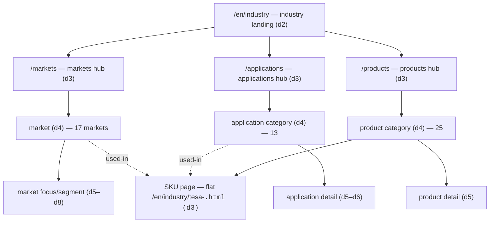
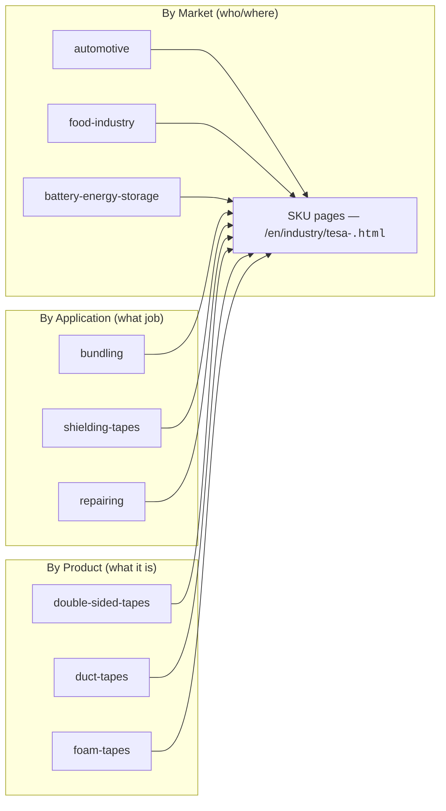

> Reverse-engineered IA — this documents the **structure and content-design patterns** of `tesa.com/en/industry` (URL shape, template/module composition, taxonomy, CTA/download/feed conventions), not Tesa's copy, imagery, or code. Derived from a 313-URL crawl with 60 deep-extracted pages (`data/inventory.json`, `data/pages.json`, `data/nav.json`). Cross-reference: `tesa-sitemap.md`.

# Tesa Industry — IA / Design Patterns

## 0. Executive summary

Tesa Industry is a **catalog-driven platform site**, not a set of bespoke pages. Three things make it reproducible without further reference:

1. **A single hub → category → detail spine** is reused three times — once each for **Markets**, **Applications**, and **Products** — with depth encoded directly in the URL.
2. **Every page is assembled from a fixed library of ~25 named modules.** The hero is module #1 on virtually every content page; a contact closer (`contact-teaser` or `inline-form`) sits near the end; `page-teasers` drive lateral discovery. Pages differ by *which* modules in *what order* — not by custom layout.
3. **Three parallel taxonomies (Market / Application / Product) all resolve to the same flat SKU pages** (`/en/industry/tesa-<code>.html`). This is a faceted, cross-cut IA: any SKU is reachable from many entry paths.

There is **no** top-level "Technologies", "Resources", "Downloads", or "Knowledge" section. Technologies are implicit in product categories / adhesive types; downloads are **embedded** via a `downloads` module on product, market, application, and SKU pages; knowledge/insights live in the corporate **Press & Insights** feed.

Verified counts (module frequencies are over the **60 deep-extracted pages** — a representative sample of the 313-path inventory, so treat them as indicative ratios, not site-wide totals): 313 unique `/en/industry` URLs; markets 111 pages (depth 3–8), products 33 (3–5), applications 29 (3–6), plus **134 flat SKU `.html` pages**. Of the 60 deep pages: `anchor-page-navigation` on **42**, a contact closer (`contact-teaser`/`inline-form`) on **49**, the `downloads` module on **28** (80 datasheet files total). Hero (`*-stage`) is module #1 on **58/60** content pages — the two exceptions are the **contact** page (`headline-module` first, form-led) and the corporate **press feed** (`highlight-feed` first).

---

## 1. The hub → category → detail spine

Each of the three primary sections is the same three-tier shape. Depth = number of URL segments after the domain.

| Section | Hub (d3) | Category (d4) | Detail | Verified scale |
|---|---|---|---|---|
| **Markets** | `/en/industry/markets` | 17 markets, e.g. `/markets/automotive` | focus/segment children, e.g. `/markets/automotive/ev-battery`, depth to **d8** under `paper-print` | 111 paths |
| **Applications** | `/en/industry/applications` | 13 categories, e.g. `/applications/protection` | application detail, e.g. `/applications/protection/surface-protection/indoor-usage` (d6) | 29 paths |
| **Products** | `/en/industry/products` | 25 categories, e.g. `/products/foam-tapes` | product detail, e.g. `/products/foam-tapes/acrylic-foam-tapes` (d5) → then flat SKUs | 33 paths + 134 SKUs |

**Depth conventions to copy:**
- **d2** = the section's own landing (`/en/industry` doubles as the markets hub — `/en/industry` and `/en/industry/markets` return identical module sequences and links).
- **d3** = section hub.
- **d4** = category (a market, an application category, a product category).
- **d5** = first-level detail (market focus topic; application sub-type; product sub-type).
- **d6–d8** = deep editorial nesting, used almost exclusively under Markets (`paper-print` and `industrial-converter-partners` carry the deepest trees).
- **SKU pages are an exception to nesting**: they live flat at **d3** as `/en/industry/tesa-<code>.html`, regardless of which category "owns" them.

The 17 markets (verified): appliances, automotive, battery-energy-storage-systems, building-industry, distribution-partners, electronics, food-industry, health-markets, industrial-converter-partners, metal-industry, paper-print, server-and-data-centre, smart-cards, solar-industry, transportation-industry, wind-energy, wire-harnessing.

The 13 application categories: bonding, bundling, debonding-on-demand, insulation, marking, masking, mounting, packaging, protection, repairing, sealing, shielding-tapes, thermal-management.

---

## 2. The module-composition pattern

Pages are **not** hand-laid-out. Each page is an **ordered list of named modules** (`moduleSeq` in the crawl) drawn from one shared library. To reproduce a page type, reproduce its module sequence.

### 2.1 Module library (observed occurrence counts across 60 deep pages)

| Module | Role | Seen |
|---|---|---|
| `static-stage` / `static-activation-stage` / `consumer-stage` | **Hero** (always first) | 46 / 11 / 1 |
| `paragraph-2022`, `paragraph` | Rich-text body block (the workhorse) | 201 / 12 |
| `marg-t--component` | Vertical-spacing spacer | 46 |
| `anchor-page-navigation` | In-page anchor jump-nav (sticky section links) | 42 |
| `image-text-stacked`, `image-with-caption`, `infotext-image` | Image + text blocks | 35 / 4 / 10 |
| `headline-module`, `blue-headline` | Section header | 31 / 3 |
| `tip-steps` | Numbered step / how-to list | 29 |
| `contact-teaser` | Contact CTA block (closer) | 26 |
| `downloads` | Embedded datasheet/flyer list | 28 |
| `highlight-teasers` | Feature/benefit teasers | 21 |
| `inline-form` | Embedded lead-gen contact form (closer) | 21 |
| `faq` | FAQ accordion | 19 |
| `page-teasers` | "Discover more" related-page cross-links | 15 |
| `card-slider` | Carousel (used as market/area selector) | 3 |
| `infotext-image`, `image-gallery`, `media-opener` | Service/media blocks (solution-center, SKU) | 10 / 3 / 3 |
| `table` | Spec/comparison table | 5 |
| `area-teasers`, `insights-feed`, `highlight-feed` | Press/insights feeds | 5 / 2 / 1 |
| `l-teaser`, `article-gallery-growth`, `related-applications` | Cross-link / story teasers | 6 / 3 / 1 |
| `quicklinks`, `job-list-filter` | Careers controls | 2 / 1 |
| `insertation`, `insertation-location`, `contact-person-teaser`, `image-map` | Embeds (maps, contact, hotspot images) | 7 / 1 / 2 / 2 |

### 2.2 The three composition invariants (across the 60 deep pages)

1. **Hero first.** Module #1 is a `*-stage` on **58/60** content pages. The two exceptions are the **contact** page (`headline-module` first — form-led) and the corporate **press feed** (`highlight-feed` first). Everything else opens on a hero.
2. **Contact closer near the end.** A `contact-teaser` and/or `inline-form` appears on **49 of 60** pages, almost always in the final third. `inline-form` is the most common *last* module; `faq` and `page-teasers` also frequently close.
3. **`page-teasers` is the lateral-discovery primitive.** It is how a page hands the user sideways to sibling/related pages ("Discover more", "You might also be interested in", "Take a look at our other main focus topics"). It is what stitches the otherwise-tree-shaped IA into a graph.

### 2.3 Canonical module sequences per page type

Reproduce these orderings to reproduce the system. (Source: `data/pages.json[].moduleSeq`.)

| Page type | Canonical module sequence | Signature H2s / CTAs |
|---|---|---|
| **industry landing = markets hub** | `static-activation-stage → card-slider → highlight-teasers → contact-teaser → page-teasers` | "Select your market" · "Benefits of partnering with us" · "Discover more". CTAs: Find out more / Learn more / Find your contact / Get in touch |
| **market** (17) | `static-stage → anchor-page-navigation → paragraph-2022(×n) → highlight-teasers → inline-form` (+`downloads`/`faq`/`contact-teaser` on richer markets) | "Key application areas in…", "Our portfolio of…", "Reach out to learn more". Most carry **1 download** flyer |
| **market focus/segment** (d5+) | `static-stage → headline-module → tip-steps → image-with-caption → image-text-stacked → inline-form → downloads → page-teasers` | "Our offer…", "Understanding your requirements", "Let's go together" |
| **applications hub** | `static-stage → anchor-page-navigation → headline-module → page-teasers → contact-teaser` | "Find the right adhesive tape based on your application" |
| **application category** (13) | `static-stage → anchor-page-navigation → paragraph-2022(×n) → contact-teaser → faq` (+`downloads`/`inline-form`/`image-text-stacked` variants) | "Typical \<x\> applications", "Overview of our \<x\> tapes", "\<x\>: FAQs" |
| **application detail** (d5/6) | `static-stage → anchor-page-navigation → paragraph-2022 → image-text-stacked → contact-teaser → tip-steps → faq → inline-form` — but deep leaf details can be minimal: `static-activation-stage → contact-person-teaser → marg-t--component` | varies; leaf nodes are often stubs |
| **products hub** | `static-stage → headline-module → page-teasers → paragraph-2022 → contact-teaser` | "Your partner for industrial adhesives", "Find the right adhesive tape type…", "Product overview" |
| **product category** (25) | `static-stage → anchor-page-navigation → paragraph-2022 → image-text-stacked → contact-teaser → faq` (+`downloads`) | "Features of \<x\>", "…applications for \<x\>", "Overview of \<x\>", "\<x\>: FAQ". CTAs: Contact / Downloads |
| **product detail** (d5) | `static-activation-stage → anchor-page-navigation → paragraph-2022 → media-opener → downloads → page-teasers` | spec-led; **datasheet downloads present** |
| **SKU** (flat `.html`)* | hero → `anchor-page-navigation` → `paragraph-2022` (specs) → `media-opener` → **`downloads`** (datasheets) → `page-teasers` | reached via category/market/application links, search, mega-menu — not by URL nesting |
| **Customer/Application Solution Center** | `static-activation-stage → image-gallery → infotext-image(×5) → paragraph-2022` | 5 services: Product Recommendation · Certification · On-site Support · Training · Application Process Engineering |
| **contact-us-industry** | `headline-module → inline-form → insertation-location(office map) → page-teasers` | "Our direct contact information", "You might also be interested in" |

\* The 134 SKU `.html` pages were inventoried but not deep-extracted in this crawl; the sequence shown is the SKU template as observed on the deep-extracted product-detail page `team-4965-assortment` and stated in the build spec.

---

## 3. The anchor-page-navigation pattern

Long category/detail pages get a sticky **in-page jump-nav** (`anchor-page-navigation`) as module #2, immediately after the hero. It appears on **42 of 60** deep pages — i.e. it is the default for any page with multiple body sections.

- **Where it appears:** every market, every application category, every product category, and most details. (Hubs that are mostly teasers — markets landing, products hub — skip it; very short leaf pages skip it.)
- **What it links to:** the page's own `headline-module`/`paragraph-2022` section headers (the H2s), letting users jump within a single long page rather than paginating.
- **Implication for DEON:** any page template that renders ≥3 body sections should auto-generate an anchor nav from its section headings. It is a function of section count, not a per-page decision.

---

## 4. Three parallel taxonomies → one SKU set (faceted IA)

The defining feature. The same product (SKU) is classified **simultaneously** along three independent axes, each with its own browse tree, and **all three resolve to the same flat SKU pages**.

**Evidence from `pages.json[].links` (in-page cross-links):**
- The application page `/applications/repairing` links **out to ~38 SKU `.html` pages** (tesa-4646, tesa-4258-pv1, tesa-60462-pcr-duct-tape, …) — applications are "used-in" indexes into the SKU set.
- The market `/markets/food-industry` links to ~18 SKUs (tesa-6081, tesa-4917, tesa-4713, …); `/markets/battery-energy-storage-systems` links to tesa-58352, tesa-61024-cell-wrapping, tesa-4428, etc.
- The application `/applications/shielding-tapes` links to tesa-60272/60274/60860/… **and** to the product category implicitly via the same SKU set.
- Cross-axis links exist too: `/applications/mounting` links *sideways* into product categories (`/products/foam-tapes`, `/products/transfer-tapes`), into markets (`/markets/automotive`, `/markets/building-industry/furniture`), and into press stories — one page touching all three taxonomies plus the feed.

**Consequence:** there is no single canonical "parent" for a SKU. The same `tesa-4713.html` is reachable from `applications/packaging`, `markets/food-industry`, and a paper-tapes product category. The IA is a **graph with three roots**, not a tree. The `page-teasers` and `contact-teaser` modules (and the explicit `links` lists) are the edges.

---

## 5. Cross-cutting content-design patterns

### 5.1 CTA pattern — recurring "contact us" surfaces
The site funnels relentlessly to one action: *talk to a tape expert*. Same few CTAs everywhere.

| Surface | Mechanism | Recurring labels |
|---|---|---|
| Mid/late page block | `contact-teaser` (26 pages) | "Get in touch", "Find your contact" |
| Embedded form | `inline-form` (21 pages) | "Contact", "Contact us", "Get in touch", "Downloads" |
| Closing H2 phrasing | — | "Let's go together", "Reach out to learn more", "Get in touch now", "Contact our industry experts" |
| Dedicated page | `/en/industry/contact-us-industry` | hero-less: `headline-module → inline-form → office map → page-teasers` |

DEON should treat "contact/lead-gen" as a **module**, not a page — droppable into any template, present on ~68% of deep pages.

### 5.2 Downloads pattern — embedded datasheets, **no central resource hub**
- The `downloads` module appears on **28 of the 60 deep pages** (every market page + every product category, plus market-focus and SKU pages); **80 download items** total across the sample. There is **no** `/resources` or `/downloads` section.
- Downloads are **co-located with context**: a market page carries that market's assortment folder (e.g. appliances → "Adhesive tape solutions for the appliance industry"); an application page carries that job's flyers (masking → 7 PDFs incl. "Automotive masking tapes", "Powder coating folder"); SKU/product pages carry datasheets.
- Files resolve to a flat path: `/en/files/download/<id>,<rev>,<slug>.pdf`.
- **Pattern for DEON:** attach a `downloads[]` field to catalog entries (market, application, product, SKU) and render the `downloads` module wherever that entry has files. Never build a standalone library.

### 5.3 Feeds pattern — knowledge lives in Press & Insights
- "Insights/knowledge" is **not** in `/en/industry`; it is the corporate `/en/about-tesa/press-insights`, built entirely from feed modules: `highlight-feed → insights-feed → area-teasers → insights-feed → area-teasers`.
- Sections by H2: **Press**, **Insights**, **Most read**, "Our tesa tape heroes".
- Industry pages **consume** this feed by linking into individual `/press-insights/stories/*.html` items (e.g. the landing links to "introducing-tesa-flamextinct", "patch-instead-of-plug-porsche"). Stories are referenced as supporting evidence, not duplicated.

### 5.4 Solution-center / lead-gen pattern
- `/en/industry/application-solution-center` ("Customer Solution Center") is a **service-marketing page**, distinct from a product page: `static-activation-stage → image-gallery → infotext-image ×5 → paragraph`.
- The five `infotext-image` blocks are the five services (Product Recommendation, Certification, On-site Support, Training, Application Process Engineering) — a fixed, repeatable "services" pattern.
- Reinforced by deep market focus pages (e.g. `appliances/collaboration`) whose H2s push toward "a sales visit, a customer solution center project, or a tailored inhouse tech day" — lead-gen is woven into the segment level, not just a standalone page.

---

## 6. Naming & URL conventions

| Convention | Rule | Example(s) |
|---|---|---|
| **Locale prefix** | everything under `/en` | `/en/industry`, `/en/about-tesa` |
| **Section roots** | lowercase, single noun/phrase, hyphenated | `/markets`, `/applications`, `/products`, `/contact-us-industry`, `/application-solution-center` |
| **Slugs** | lowercase-hyphen, no spaces/camelCase | `battery-energy-storage-systems`, `industrial-converter-partners`, `surface-protection` |
| **Nesting = hierarchy** | parent = URL minus last segment; depth = segment count | `/markets/automotive/ev-battery` (d6 child of automotive) |
| **SKU pages are flat** | `/en/industry/tesa-<code>.html` regardless of category | `tesa-4965.html`, `tesa-flamextinct-45001.html`, `nopi-4051-pv1-pvc-duct-tape.html` |
| **SKU code-naming** | `tesa-<number>` ± variant/qualifier suffix; sub-brands keep brand token | `tesa-4313-pv0` / `tesa-4313-pv10`, `tesa-acxplus-76730-box-seal`, `tesa-flamextinct-45063` |
| **Downloads** | flat under `/en/files/download/<id>,<rev>,<slug>.pdf` | `…/996527,2,tesa-aluminum-foil-tape-overview.pdf` |
| **Corporate vs industry** | non-product content under `/en/about-tesa`, **outside** `/en/industry` | sustainability, press-insights, career, locations, legal |
| **Landing pages / campaigns** | parked under `/en/industry/lp/<campaign>` | `/lp/covid/safety-protection-tapes`, `/lp/mounting/tesa-755xx-next-gen-transfer-tapes` |

**Top nav (verified, `nav.json`):** Markets · Applications · Products · Sustainability · Press & Insights · Contact us. (Sustainability/Press/Career point to `/en/about-tesa/*` — i.e. corporate, surfaced in the industry nav.) **Footer** = locations/subsidiaries + legal (Imprint, Privacy, Accessibility, Conditions, T&C).

---

## 7. How DEON should map these to its catalog architecture

DEON already runs a catalog-driven model (`deon-catalog.js` + `window.DEON` feeding thin page templates). The Tesa patterns map onto it almost 1:1 — adopt these as concrete build rules:

1. **Three browse axes, one SKU table.** Model `markets[]`, `applications[]`, `products[]` as three taxonomies, and a single `skus[]` table that each axis references by ID (`usedIn` arrays). Render the *same* SKU page no matter which axis the user arrived from. This is the Tesa faceted spine — do not give a SKU one hard parent.

2. **Templates = ordered module lists, not layouts.** Define a `moduleLibrary` and let each catalog entry declare a `moduleSeq`. Enforce the three invariants: **hero is module #1**, a **contact closer** (`contact-teaser`/`inline-form`) sits near the end, and **`page-teasers`** renders related entries. DEON's existing segment-explorer is the right precedent — generalise it to all five page types in §2.3.

3. **Hub → category → detail at fixed depths.** Mirror the depth convention: hub (d3) → category (d4) → detail (d5), deep editorial nesting only where a market needs it. Keep SKU pages **flat** (`/product/<code>` or `<code>.html`-style), reachable from many entries.

4. **Auto-generate anchor nav.** Any template rendering ≥3 body sections emits an `anchor-page-navigation` from its section headings — derive it, don't author it.

5. **Embed downloads; don't build a resource hub.** Give markets, applications, products, and SKUs a `downloads[]` field; render the downloads module wherever files exist. Skip a central `/resources` page entirely — it doesn't exist in the reference.

6. **Knowledge = a feed, referenced not duplicated.** Put insights/press in one feed section and have catalog pages *link into* individual stories (via `page-teasers`), exactly as the Tesa landing references story pages.

7. **Lead-gen as a module + a services page.** Reuse the contact-teaser/inline-form module sitewide, and build one solution-center-style services page (5 `infotext-image` service blocks) as the conversion hub.

8. **Naming discipline.** Lowercase-hyphen slugs; SKU codes carry the brand token and variant suffix; keep corporate (about/press/sustainability/careers/legal) on a parallel `/about-deon`-style branch, surfaced in nav but outside the `/industry` product tree.

**Net:** DEON reproduces Tesa's system by maintaining the catalog (3 taxonomies + SKU table + downloads) and the module library — the page templates stay thin. Extending the site = editing the catalog, never authoring a page.
