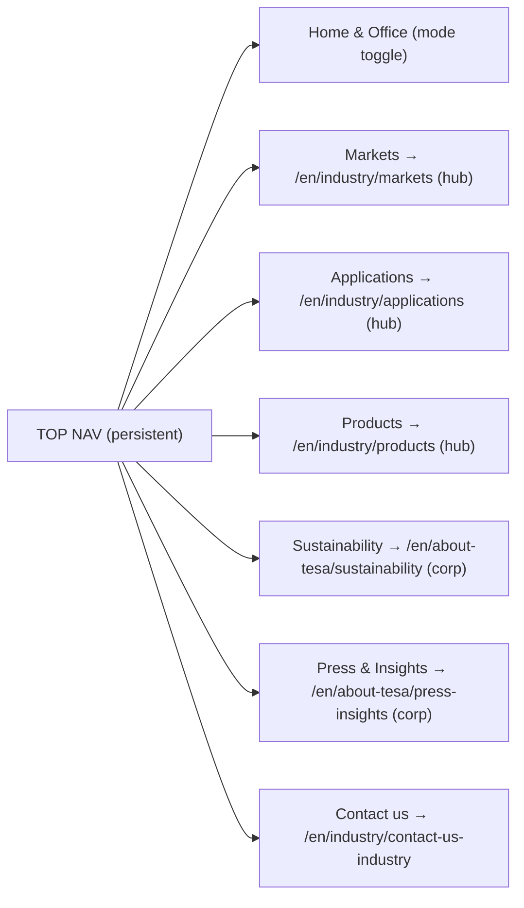
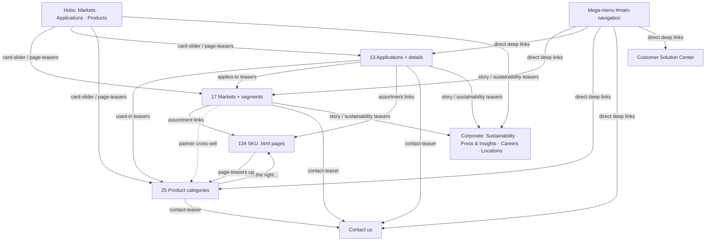

> Reverse-engineered IA — this maps the **navigation structure** of `tesa.com/en/industry` inferred from a crawl (URL nesting, in-page links, module sequences). It is not Tesa's content, code, or proprietary markup.

# Tesa Industry — Navigation Structure

This document maps every navigation system on the Tesa Industry site and how they interlock. There are **six navigation surfaces**, each reaching a different slice of the 313-path inventory:

1. **Top navigation** — **6 primary section items** (Markets · Applications · Products · Sustainability · Press & Insights · Contact us, per `nav.json`), plus a **Home & Office** audience toggle (a consumer/B2B mode switch, not an Industry content hub).
2. **Mega-menu** (the hamburger overlay) — exposes the deep markets / applications / products trees. *Provenance: its full link inventory IS observed (the entire 313-path tree surfaces from one page's links); the overlay element `#main-navigation` is corroborated by separate DOM inspection + Tesa-platform convention, not asserted from the page-crawl JSON.*
3. **Breadcrumbs** — URL-derived ancestor trail.
4. **In-page anchor nav** (`anchor-page-navigation` module) — intra-page jump links.
5. **Teaser cross-links** (`page-teasers`, `card-slider`, `highlight-teasers`, `contact-teaser`) — lateral discovery between sections.
6. **Footer** — corporate, locations, legal.

Root of the section: **`/en/industry`** (template: _industry landing_, which is identical to the markets hub `/en/industry/markets` — same title, modules, H2s, and link set). Corporate items live one level up under **`/en/about-tesa`**.

---

## 1. Top navigation

Persistent header bar. **`nav.json.top` captures exactly 6 primary items** (rows 2–7 below); the **Home & Office** toggle (row 1) is the consumer/B2B mode tab observed in the header but outside the primary `.horizontal-nav__links` set. So: **6 primary nav items + 1 audience toggle.**

| # | Label | Target (`href`) | Type | Behaviour |
|---|---|---|---|---|
| 1 | **Home & Office** | (consumer site root, e.g. `/en`) | Audience toggle | Switches out of the Industry (B2B) experience into the consumer/Home & Office mode. Not a content hub inside `/en/industry`. |
| 2 | **Markets** | `/en/industry/markets` | Section hub | Lands on the markets hub (_industry landing_ template). Hamburger/mega-menu enumerates all 17 markets + segment children. |
| 3 | **Applications** | `/en/industry/applications` | Section hub | Lands on applications hub. Mega-menu enumerates 13 application categories + details. |
| 4 | **Products** | `/en/industry/products` | Section hub | Lands on products hub. Mega-menu enumerates 25 product categories. |
| 5 | **Sustainability** | `/en/about-tesa/sustainability` | Corporate hub | Leaves `/en/industry` for the corporate sustainability hub. |
| 6 | **Press & Insights** | `/en/about-tesa/press-insights` | Corporate feed hub | Leaves `/en/industry` for press releases + insights/stories feeds. |
| 7 | **Contact us** | `/en/industry/contact-us-industry` | Utility page | Lands directly on the contact form page (no hub/flyout). |

**Notes on behaviour**
- Items 2–4 (Markets · Applications · Products) are the three **content sections**: each top item is BOTH a clickable hub-landing AND the entry point whose deep tree is revealed by the mega-menu (Section 2).
- Items 5–6 (Sustainability · Press & Insights) point **outside** `/en/industry` to `/en/about-tesa/*` — they are corporate, shared with the whole tesa.com site, not industry-scoped. Their templates differ from industry pages (sustainability = story-driven; press = feed-driven; see Section 6 of the sitemap / template notes).
- Item 1 (Home & Office) is a **mode switch**, not a content destination — it is the B2C counterpart to the B2B Industry experience.
- Item 7 (Contact us) is a single utility destination, not a hub — it renders `headline-module → inline-form → insertation-location (office map) → page-teasers`.
- **Careers** (`/en/about-tesa/career`) is reachable via footer/corporate chrome but is **not** in the industry top nav.



---

## 2. Mega-menu (`#main-navigation`) — the deep-tree exposer

The hamburger / "menu" control opens a **full-width mega-menu overlay** (`#main-navigation`). This is the surface that exposes the entire 313-path inventory — the top nav only links to the three hubs, so the mega-menu is the **only chrome that lets a user jump directly to a deep node** (e.g. a market segment or a product category) without first landing on a hub and scrolling its `card-slider`/`page-teasers`.

> **Provenance flag.** What is *observed in the crawl*: the complete link inventory the menu exposes (all 313 paths surfaced from a single page's links — only a mega-menu can enumerate the full tree on every page). What is *inferred / separately corroborated*: the overlay's DOM identity (`#main-navigation`, hamburger-triggered, portal-rendered full-width) — this matches the Tesa platform and was confirmed by direct DOM inspection, but is not in the page-crawl JSON. Treat the link map as fact and the exact overlay mechanics as a faithful reconstruction.

### Structure (section columns → category lists → detail children)

The mega-menu mirrors the three content sections as parallel columns, each expanding the section's own tree:

**Column A — Markets** (`/en/industry/markets`) → 17 market entries → each market expands its focus-topic / segment children:

```
Markets
├── Appliances ............... /markets/appliances
│     ├── Collaboration · Commercial Appliances · Copiers Printers · Home Comfort
│     └── Innovation · Ovens & Cooktops · Refrigerators & Freezers · Sustainability · Washing Machines & Dishwashers
├── Automotive ............... /markets/automotive
│     └── Car Body · EV Battery · Exterior · Glass · Interior
├── Battery Energy Storage Systems .. /markets/battery-energy-storage-systems  (leaf)
├── Building Industry ........ /markets/building-industry
│     └── Adhesive Flooring · Air & Water Proofing · Doors · Elevator · Furniture · Interior Fit-Out
│         · Interior Wall Cladding · Mirror Mounting · Trims/Profiles · Windows
├── Distribution Partners .... /markets/distribution-partners → Tesa Alliance Partner Program
├── Electronics .............. /markets/electronics
│     └── AR/VR · Display · Foldables · Notebook · Smartphone · Tablet · Wearables
├── Food Industry ............ /markets/food-industry  (leaf)
├── Health Markets ........... /markets/health-markets  (leaf)
├── Industrial Converter Partners .. /markets/industrial-converter-partners
│     └── Industrial Converting Partners Tape Technology
│         └── Acrylic Core · BSR · Double-Sided Film · Double-Sided Tissue · Electrically Conductive
│             · Flexographic & Process Consumables · Foam · LSE Mounting · Masking · Repairing/General
│             · Surface Protection · Thermal Interface Material · Transfer/Scrim (13 tape-technology children)
├── Metal Industry .......... /markets/metal-industry  (leaf)
├── Paper & Print ........... /markets/paper-print  (deepest market — to depth 8)
│     ├── Foam Advisor · Market Segments (Corrugators → Contact, Flexible Packaging, Label, Liquid Packaging Board, Newspaper/Magazine, Paper Production)
│     ├── Packaging Potential (Book a Consultation · Efficiency & Flexibility · FAQ · Refined Quality → 3 guides · Request a Trial)
│     ├── Plate Mounting → Consultation Request
│     └── Tape Applications (Corrugator Design · Plate Mounting Tapes Flexo → 3 sub · Process Tapes ×3 · Splicing Tapes → 6 sub)
├── Server & Data Centre .... /markets/server-and-data-centre  (leaf)
├── Smart Cards ............. /markets/smart-cards  (leaf)
├── Solar Industry .......... /markets/solar-industry → Next-Gen · Thin-Film · Wafer-Based modules
├── Transportation Industry . /markets/transportation-industry → Aviation · Marine · Railway · RVs/Caravans · Trucks/Trailers
├── Wind Energy ............. /markets/wind-energy  (leaf)
└── Wire Harnessing ......... /markets/wire-harnessing → Basic Bundling · Product Finder
```
*(111 paths total under markets, depth d3–d8.)*

**Column B — Applications** (`/en/industry/applications`) → 13 categories → application-detail children:

```
Applications
├── Bonding ............ /applications/bonding (leaf)
├── Bundling ........... /applications/bundling (leaf)
├── Debonding on Demand  /applications/debonding-on-demand (leaf)
├── Insulation ......... /applications/insulation → Damping Tapes
├── Marking ............ /applications/marking → Marking & Identification Labels
├── Masking ............ /applications/masking → Cloth · Filmic · Paper · Tesa Precision Mask
├── Mounting ........... /applications/mounting (leaf)
├── Packaging .......... /applications/packaging → Filmic Tapes
├── Protection ......... /applications/protection → Barrier Warning · Car Paint Protection · Social Distancing
│                              · Surface Protection → Indoor · Outdoor · Permanent (depth 6)
├── Repairing .......... /applications/repairing (leaf)
├── Sealing ............ /applications/sealing → Bag Sealing
├── Shielding Tapes .... /applications/shielding-tapes (leaf)
└── Thermal Management . /applications/thermal-management (leaf)
```
*(29 paths total under applications, depth d3–d6.)*

**Column C — Products** (`/en/industry/products`) → 25 categories → some with detail children:

```
Products
├── Aluminium Foil Tapes · Anti-Slip · Cloth · Conductive
├── Double-Sided Tapes → Team 4965 Assortment
├── Duct · Filament Strapping · Filmic · Flame-Retardant
├── Foam Tapes → Acrylic Foam · PE Foam
├── Grip
├── High Performance Bonding Tape → ACXplus Consultation Request
├── Light Blocking · Optically Clear · Paper · Products Finder
├── Removable (residue-free) · Sandblasting · Stretch Release · Structural Adhesives
├── Sustainable Tapes → Biodegradable · Compostable · Recyclable
└── Tape Dispenser · Tissue · Transfer · Waterproof
```
*(33 paths total under products, depth d3–d5. The ~134 SKU detail pages at `/en/industry/<sku>.html` are NOT separate columns — they are leaves reached from a product category's "Find the right…" list, from market/application "used-in" links, from search, or from datasheet links.)*

The mega-menu typically also surfaces the utility/hub shortcuts that aren't in the top nav: **Customer Solution Center** (`/en/industry/application-solution-center`), **Contact us** (`/en/industry/contact-us-industry`), and the **Products Finder** (`/en/industry/products/products-finder`).

---

## 3. Breadcrumbs

Breadcrumbs are **URL-derived**: each segment of the path becomes a crumb, ancestors are links, the current page is plain text. Trail shape: `Home › <Section> › <Category> › <Sub> › <Detail>`.

**Example trail 1 — a market segment (depth 5):**
`/en/industry/markets/appliances/commercial-appliances`
> Home › Markets › Appliances › *Commercial Appliances*
- `Home` → `/en/industry` · `Markets` → `/en/industry/markets` · `Appliances` → `/en/industry/markets/appliances` · *Commercial Appliances* (current, not linked)

**Example trail 2 — an application detail (depth 6):**
`/en/industry/applications/protection/surface-protection/indoor-usage`
> Home › Applications › Protection › Surface Protection › *Indoor Usage*
- Each ancestor links to its hub/category page; `Indoor Usage` is current.

**Example trail 3 — a deep paper-print node (depth 8):**
`/en/industry/markets/paper-print/tape-applications/plate-mounting-tapes-flexographic-printing/tesa-softprint-foam-tapes/tesa-softprint-foam-advisor`
> Home › Markets › Paper & Print › Tape Applications › Plate Mounting Tapes Flexographic Printing › Tesa Softprint Foam Tapes › *Tesa Softprint Foam Advisor*

**SKU exception:** SKU pages are flat (`/en/industry/tesa-4965.html`, depth 4 but no nesting). Their breadcrumb cannot be derived from the URL beyond `Home › <SKU>` — so on SKU pages the breadcrumb is shallow (Home › product name) and the contextual "up" path is instead provided by the `page-teasers` "related" module, not the URL trail.

---

## 4. In-page anchor navigation (`anchor-page-navigation`)

A secondary, **intra-page** nav: a sticky jump-bar that links to the H2 anchors on the same page. It appears as the 2nd module on virtually every market, application category, application detail, and product category page (and on SKU pages). It does not change page — it scrolls. Example: on `/en/industry/applications/shielding-tapes` it jumps between "Find your ideal shielding tape", "Why you should be concerned about EMI/RFI", "Shielding tapes delivering solutions…", "FAQs", "Get in touch now". This is how Tesa keeps long single-page category templates navigable instead of splitting into more URLs.

---

## 5. Footer navigation

Source: `nav.json.footer` (21 entries). The footer is **corporate/global**, not industry content — it carries zero links into markets/applications/products categories. It groups into four functional clusters:

### Footer column groups

| Group | Items (label → href) |
|---|---|
| **Contact** | Contact us → `/en/industry/contact-us-industry` · tesa Headquarters → `/en/about-tesa/locations-subsidiaries/tesa-headquarter` |
| **Plants & Production sites** | tesa Plant Concagno · tesa Plant Suzhou · Where tesafilm® is made (Offenburg) · tesa Plant Sparta · tesa Plant Hamburg · tesa site Haiphong — all under `/en/about-tesa/locations-subsidiaries/tesa-plant-*` / `tesa-site-*` |
| **Regional offices / Subsidiaries** | Hamburg, Europe (`europe-headquarters.html`) · Shanghai, China (`china-shanghai.html`) · Singapore, Asia Pacific (`singapore.html`) · Grand Rapids, North America (`usa-headquarters.html`) · Curitiba, South America (`brazil.html`) · Sao Paulo, South America (`tesa-brazil-lam.html`) · Istanbul, Turkey (`regional-headquarter-middle-east-tuerkiye-and-africa.html`) — all under `/en/about-tesa/locations-subsidiaries/*` |
| **Legal & Corporate** | Imprint · Privacy Statement · Accessibility Statement · Conditions of use · Terms & Conditions — all under `/en/about-tesa/legal-information/*` · plus the copyright line **©tesa SE – A Beiersdorf Company** → `/en` |

**Observations**
- The footer's only industry-scoped link is **Contact us**. Everything else points to `/en/about-tesa/locations-subsidiaries/*` (a global "where we are" cluster: HQ, 6 plants/sites, 7 regional offices) or `/en/about-tesa/legal-information/*`.
- Locations appear in **two formats**: clean paths (`…/tesa-plant-offenburg`) for plants and `.html` paths (`…/europe-headquarters.html`) for regional offices — consistent with the two ways those pages were authored.
- The copyright line doubles as a link to the global tesa.com root (`/en`).
- There is **no footer sitemap / no footer link block for Markets, Applications, or Products** — deep navigation is delegated entirely to the mega-menu and to on-page teasers. This is a deliberate IA choice: footer = trust/legal/where-we-are; mega-menu = catalog.

---

## 6. Navigation relationships — how every node is reachable

### 6.1 Which surface reaches which page type

| Page type (count) | Top nav | Mega-menu | Breadcrumb | Anchor nav | Teasers / cross-links | Footer |
|---|---|---|---|---|---|---|
| Section hubs — markets/applications/products (3) | ✅ direct | ✅ column heads | ✅ as crumb | — | ✅ from landing | — |
| Markets (17) | via hub | ✅ direct | ✅ up to hub | ✅ within page | ✅ card-slider on hub; lateral from applications | — |
| Market segments (d5–d8) | — | ✅ direct | ✅ up to market | ✅ within page | ✅ from parent market `links[]` | — |
| Application categories (13) | via hub | ✅ direct | ✅ up to hub | ✅ within page | ✅ page-teasers on hub | — |
| Application details (d5–d6) | — | ✅ direct | ✅ up to category | ✅ within page | ✅ from parent | — |
| Product categories (25) | via hub | ✅ direct | ✅ up to hub | ✅ within page | ✅ page-teasers on hub; "used-in" from markets/apps | — |
| SKU pages (134, flat `.html`) | — | (some surfaced) | shallow only | ✅ within page | ✅ **primary route**: from product category "Find the right…", market/app "used-in", downloads, search | — |
| Contact us (1) | ✅ direct | ✅ shortcut | — | — | ✅ `contact-teaser` everywhere | ✅ direct |
| Customer Solution Center (1) | — | ✅ shortcut | ✅ up to /industry | — | ✅ from landing `links[]` | — |
| Products / Wire-harnessing / Splicing finders | — | ✅ (Products Finder) | ✅ | — | ✅ "discover with our product finder" | — |
| Sustainability / Press & Insights (corp) | ✅ direct | — | own corp trail | — | ✅ from market/app stories & `card-slider` | — |
| Careers (corp) | — | — | own corp trail | — | ✅ from corporate chrome | (via corp footer) |
| Locations / Legal | — | — | own corp trail | — | — | ✅ direct |

### 6.2 The four ways a user reaches any node

1. **Top-nav → hub (downward, broad).** Click Markets/Applications/Products → land on the hub. Hubs are shallow launchers: the markets/landing hub renders `static-activation-stage → card-slider("Select your market") → highlight-teasers("Benefits of partnering") → contact-teaser → page-teasers("Discover more")`. From here you pick a tile.
2. **Mega-menu → deep (downward, precise).** Open `#main-navigation` and jump straight to any market segment, application detail, or product category — the only chrome that skips the hub and goes N levels deep in one click. This is what makes the 313-path tree reachable.
3. **Breadcrumb → ancestor (upward).** From any deep page, climb back to category → section → home via URL-derived crumbs (SKU pages excepted — they climb via teasers, not URL).
4. **Teasers → lateral (sideways, cross-section).** The `page-teasers` ("Discover more" / "You might also be interested in"), `card-slider`, `highlight-teasers`, and `contact-teaser` modules carry the **cross-section graph**. Verified examples from `pages.json[].links`:
   - **Application → Product** ("used-in" / "Overview of our tapes"): `applications/bonding` → `products/foam-tapes`, `products/structural-adhesives`, `products/cloth-tapes`. `applications/mounting` → `products/filmic-tapes`, `products/high-performance-bonding-tape`, `products/transfer-tapes`, `products/tissue-tapes`.
   - **Application → Market**: `applications/mounting` → `markets/transportation-industry`, `markets/building-industry/furniture`, `markets/automotive`, `markets/electronics`, `markets/paper-print/tape-applications/plate-mounting-tapes-flexographic-printing`.
   - **Market → SKU** ("Discover our assortment"): `markets/battery-energy-storage-systems` → `tesa-58352.html`, `tesa-61024-cell-wrapping.html`, `tesa-4428.html`…; `markets/food-industry` → 19 SKU pages (`tesa-6081.html`, `tesa-4917.html`, …); `applications/repairing` → 35+ SKU pages.
   - **Product category → Market** (partner cross-sell): `products/cloth-tapes` → `markets/distribution-partners/tesa-alliance-partner-program`.
   - **Market → Market**: `markets/automotive` → `markets/wire-harnessing`.
   - **Anywhere → Contact** via `contact-teaser`: nearly every category/market page links `/en/industry/contact-us-industry`.
   - **Industry → Corporate** via stories/sustainability teasers: landing/markets hub → `/en/about-tesa/sustainability/products-and-packaging`, `/en/about-tesa/press-insights/stories/*`; `applications/debonding-on-demand` → 3 press/insights stories.

### 6.3 Section-to-section reachability graph



### 6.4 Key IA takeaways for DEON

- **Two-tier downward nav:** top nav reaches only 3 hubs; the **mega-menu is the real catalog navigator** and is mandatory to expose a deep tree. Any DEON rebuild needs an equivalent mega-menu, not just a header.
- **Breadcrumbs are free** for nested URLs but **break for flat SKU pages** — those rely on related-teasers to provide "up/around" context. DEON should either nest SKUs or guarantee a teaser-based return path.
- **Cross-section discovery is carried by ~4 teaser modules**, not by nav chrome. The market↔application↔product↔SKU↔contact graph lives in `page-teasers` / `card-slider` / `highlight-teasers` / `contact-teaser`. This is the connective tissue that turns a tree into a graph.
- **Footer is intentionally thin** (contact + locations + legal). No deep links — keeps the footer global/corporate and pushes catalog navigation up into the mega-menu.
- **Corporate vs industry split:** Sustainability, Press & Insights, Careers, and all Locations/Legal live under `/en/about-tesa/*` and are shared sitewide; only Markets/Applications/Products/Contact/Customer-Solution-Center/Finders are industry-scoped under `/en/industry`.
