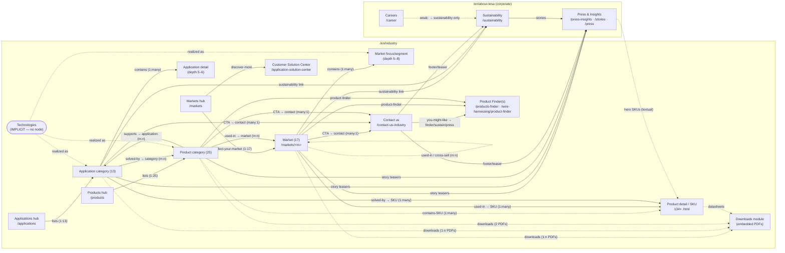

> Reverse-engineered IA — structure, relationships and cross-link topology only. No Tesa content, copy, or code is reproduced. Derived from `data/inventory.json` (313 paths), `data/pages.json` (60 deep-extracted pages with in-page links), `data/nav.json`, and cross-checked against `tesa-sitemap.md`.
>
> **Scope:** the 313-path inventory is the **`/en/industry` subtree only**. The corporate entities in this graph (Insights/Press, Sustainability, Careers) live under `/en/about-tesa`; they are sourced from **3 extra deep-extracted `/about-tesa` pages + `nav.json`** (linked from the industry top nav/footer), not counted in the 313.

# Tesa Industry — Relationship Graph

## 1. Scope & method

This document graphs **how the entity types in Tesa's industrial IA reference each other** — not just the URL tree (that lives in `tesa-sitemap.md`), but the *navigational and "used-in" edges* that turn the tree into a graph.

Two edge sources are combined:

1. **Real cross-links** — `pages.json[].links` carries the in-page industry links surfaced by recurring modules (`page-teasers` = "Discover more", `contact-teaser`, `highlight-teasers`, `image-article-teasers`, body links in `paragraph-2022`). These are *observed* edges from the 60 deep-extracted pages.
2. **Structure** — URL nesting (parent/child) and the section-hub→leaf relationships verified in the sitemap.

Edge weights below are the **aggregate count of observed cross-links** between entity types across all 60 extracted pages (computed from `pages.json`). They show where Tesa actually wires the graph densely vs. sparsely.

> Caveat made explicit: the **134 SKU `.html` pages were inventoried but not deep-extracted** (`deep SKU pages extracted: 0`). Therefore every edge *into* a SKU is observed (markets/applications/products link out to SKUs), but edges *out of* a SKU (SKU → category / SKU → market via its `page-teasers` + `downloads` template) are **template-inferred**, not measured. They are flagged as such in the edge table.

---

## 2. The ten requested entities — how each maps to the IA

| # | Requested entity | Is it a node? | Where it lives in Tesa's IA |
|---|---|---|---|
| 1 | **Markets** | Yes — first-class | `/en/industry/markets` hub → 17 market pages → focus/segment children (depth to 8). 111 paths. |
| 2 | **Applications** | Yes — first-class | `/en/industry/applications` hub → 13 categories → application-detail children (depth 5–6). 29 paths. |
| 3 | **Products** (SKUs) | Yes — first-class but **flat** | 134 SKU pages at `/en/industry/<sku>.html`. Not URL-nested under categories; reached *by link* from categories, markets, applications, search, mega-menu. |
| 4 | **Product Families / Categories** | Yes — first-class | `/en/industry/products` hub → **24 product categories + 1 `products-finder` tool** (25 depth-4 paths) → a few product-detail children. 33 paths. |
| 5 | **Technologies** | **No dedicated node — implicit** | There is no `/technologies` section. "Technology" is expressed three ways: (a) as **product categories / adhesive types** (`conductive-tape`, `structural-adhesives`, `acrylic-foam-tapes`, `transfer-tapes`); (b) as cross-cutting **application themes** (`debonding-on-demand` literally titled "Debonding on Demand technologies"; `thermal-management`, `shielding-tapes`); (c) as a **converter sub-tree** (`industrial-converting-partners-tape-technology/*` — 13 tech sub-pages). See §6. |
| 6 | **Resources** | **No dedicated node — embedded** | No `/resources` hub. "Resources" = the per-page **`downloads` module** (PDF folders/flyers) + the **`application-solution-center`** (Customer Solution Center, services) + the **`products-finder` / `wire-harnessing/product-finder`** tools. See §6. |
| 7 | **Downloads** | **No dedicated node — embedded** | Surfaced inline by the `downloads` module on product categories (2 each), markets (1 each), and applications/SKUs. All PDFs live under a shared CDN path `/en/files/download/<id>,…pdf`. See §6 + §7. |
| 8 | **Insights** | Yes — but **corporate**, not under `/industry` | `Press & Insights` = `/en/about-tesa/press-insights` (feeds: `highlight-feed` / `insights-feed` / `area-teasers`). Industry pages link *out* to story/press detail pages; the hub links back to industry only thematically. See §5. |
| 9 | **Careers** | Yes — **corporate**, weakly coupled | `/en/about-tesa/career`. Top nav exposes it via "Sustainability / Press & Insights" siblings but careers itself is **not** in the industry top nav. Almost no industry page links to careers. See §5. |
| 10 | **Sustainability** | Yes — **corporate**, thematically coupled | `/en/about-tesa/sustainability`. Linked from industry landing, packaging application, solar market, products-and-packaging sub-page. See §5. |

---

## 3. Entity-type relationship graph (Mermaid)



Legend: solid arrow = observed cross-link in `pages.json`; dotted arrow = template-inferred or structural (SKU outbound, downloads, technologies, careers).

---

## 4. Observed edge weights (aggregated from `pages.json[].links`)

Counts = number of cross-link instances of that type across the 60 extracted pages. This is the empirical "where the graph is dense" signal. (`sku` = `/en/industry/*.html`; `corp` = other `/en/about-tesa/*`; `download` = `/en/files/download/*`.)

| From | → To | Count | Reading |
|---|---|---:|---|
| application | sku | **90** | Applications are the **densest router to products**. Application category/detail pages list SKUs ("Overview of our X tapes" + repairing's huge list). |
| market | sku | **75** | Markets are the second densest router to SKUs ("Discover our assortment" lists). |
| market | market | **58** | Heavy intra-market cross-linking: market→its segments, market→adjacent market (e.g. automotive→wire-harnessing, solar→wind+electronics). |
| press | press | **40** | Press & Insights is a self-contained feed cluster (stories↔press↔heroes). |
| product (cat) | download | **36** | Product categories are download-heavy (folders/flyers per category). |
| application | download | **28** | Applications attach assortment/solution PDFs (masking=7, repairing=8). |
| market | corp | **18** | Markets link to corporate pages (privacy, locations, history, product-and-technology-development). |
| market | download | **15** | One folder per market, plus extras. |
| other(hub/landing) | market | **26** | Industry landing + markets hub each route into the 17 markets via their `card-slider` (~13 links each). |
| application | product (cat) | **13** | Applications → product categories ("solved-by"). |
| application | press | **13** | Applications → story teasers (case studies). |
| product (cat) | sku | **13** | Product category → SKU (observed only where category lists SKUs: flame-retardant=9, filament=4, etc.). |
| application | contact | **12** | `contact-teaser` on application pages. |
| product (cat) | application | **12** | Product categories → applications they serve. |
| application | market | **11** | Applications → markets that use them (mounting→6 markets). |
| product (cat) | market | **11** | Product categories → markets ("used-in"). |
| product (cat) | contact | **11** | `contact-teaser` on product pages. |
| sustainability | sustainability | **10** | Sustainability action-area self-cluster. |
| career | corp | **10** | Careers → plants/locations/about (corporate-internal). |
| market | press | **9** | Markets → story teasers. |
| product (cat) | product (cat) | **8** | Category↔category (anti-slip↔grip, conductive↔TIM). |
| application | corp | **8** | Applications → privacy/corporate. |
| sustainability | press | **6** | Sustainability → its stories. |
| market | other | **6** | Markets → finder/lp/cross-section pages. |
| market | contact / market→app | 5 / 5 | `contact-teaser`; market→application. |
| career | career | **4** | Careers self-cluster (professionals/graduates/students). |
| market | sustainability | **3** | Markets → sustainability (solar, converter, landing). |
| contact | corp / product / sustain / press | 3 / 1 / 1 / 1 | Contact page "you might also be interested in" → finder, sustainability, press. |
| application | sustainability | **1** | Packaging → sustainability. |
| career | sustainability | **1** | The *only* career→industry-ish bridge is via sustainability. |

**Key asymmetries:**
- **Applications (90) > Markets (75) > Categories (13)** as routers *to SKUs*. Tesa funnels users to a specific tape primarily through *what you're doing* (application) and *what you make* (market), less through *tape type* (category).
- **No SKU→anything edges observed** (SKUs not crawled). SKU outbound is template-only (`page-teasers` + `downloads`).
- **Careers is an island**: 10 career→corp + 4 career→career, but **0 career→market/application/product** and only **1 career→sustainability**. Industry pages essentially never link to careers.

---

## 5. Full edge table (typed, with evidence)

`obs` = observed in `pages.json` links · `tmpl` = inferred from the page's module template · `struct` = URL nesting. Cardinality given where clear.

| From | Relationship | To | Card. | Kind | Evidence (path · link / module) |
|---|---|---|---|---|---|
| Industry landing | select-your-market | Market | 1:17 | obs | `/en/industry` `card-slider` → `/markets/automotive`, `/markets/electronics`, … |
| Industry landing | discover-more | Customer Solution Center | 1:1 | obs | `/en/industry` → `/application-solution-center` |
| Industry landing | featured-story | Press & Insights | 1:n | obs | `/en/industry` → `/press-insights/stories/introducing-tesa-flamextinct.html` (+2) |
| Industry landing | featured-product | SKU (via category) | 1:1 | obs | `/en/industry` → `/products/double-sided-tapes/team-4965-assortment` |
| Markets hub | lists | Market | 1:17 | obs/struct | `/markets` identical card-slider to landing |
| Market | contains-segment | Market focus/segment | 1:many | obs/struct | `automotive` → `/automotive/ev-battery,/interior,/exterior,/car-body`; `building-industry` → 9 segments |
| Market | cross-sell | Market (adjacent) | m:n | obs | `automotive`→`wire-harnessing`; `solar-industry`→`wind-energy`,`electronics`; `wire-harnessing`←`automotive` |
| Market | used-in → product | SKU | 1:many | obs | `food-industry`→18 SKUs; `server-and-data-centre`→~19 SKUs; `wind-energy`→11 SKUs; `battery-energy-storage-systems`→9 SKUs |
| Market | uses-application | Application | m:n | obs | `distribution-partners`→`/applications/packaging,masking,bundling,repairing`; `transportation-industry`→`/applications/bundling` |
| Market | references | Product category | m:n | obs | `mounting`-linked markets; `transportation-industry`→`/products/foam-tapes/acrylic-foam-tapes` |
| Market | CTA → contact | Contact us | many:1 | obs/tmpl | `contact-teaser`/`inline-form` on every market; `battery-energy-storage-systems`→`/contact-us-industry` |
| Market | attaches | Downloads (PDF) | 1:n | obs | each market `downloads` module: `appliances`=1 folder, `smart-cards`=3, `food-industry`=1 (7.4 MB) |
| Market | story-teaser | Press & Insights | 1:n | obs | `appliances`→`/press-insights/stories/rethinking-transport-…`; `paper-print`→5 stories |
| Market | sustainability link | Sustainability | 1:1 | obs | `solar-industry`→`/about-tesa/sustainability`; `industrial-converter-partners`→`/sustainability/strategy` |
| Market | corporate ref | Corporate (locations/history/privacy) | n:1 | obs | `industrial-converter-partners`→`/about-tesa/facts-figures/history`; all → privacy-policy |
| Market | product-finder | Product Finder tool | 1:1 | obs/struct | `wire-harnessing`→`/wire-harnessing/product-finder`; `thermal-management` cites "product finder" |
| Applications hub | lists | Application category | 1:13 | obs/struct | `/applications` `page-teasers` → `insulation,marking,mounting,protection` (+ tree) |
| Applications hub | bridges-to | Products hub | 1:1 | obs | `/applications` → `/products` |
| Application category | contains-detail | Application detail | 1:many | struct | `masking`→`cloth/filmic/paper-tapes`,`tesa-precision-mask`; `protection`→`surface-protection/{indoor,outdoor,permanent}` |
| Application | solved-by → product | SKU | 1:many | obs | `repairing`→~38 SKUs; `shielding-tapes`→11 SKUs; `packaging`→~10 SKUs |
| Application | solved-by → category | Product category | m:n | obs | `bonding`→`/products/foam-tapes,structural-adhesives,cloth-tapes`; `mounting`→`filmic-tapes,foam-tapes,transfer-tapes,tissue-tapes,…` |
| Application | used-in → market | Market | m:n | obs | `mounting`→`transportation,building-industry/furniture,automotive,electronics,paper-print/…`; `bundling`→`wire-harnessing/basic-bundling` |
| Application | CTA → contact | Contact us | many:1 | obs/tmpl | `contact-teaser` on most categories → `/contact-us-industry` |
| Application | attaches | Downloads (PDF) | 1:n | obs | `masking`=7 PDFs, `repairing`=8, `thermal-management`=3, `shielding-tapes`=2 |
| Application | story-teaser | Press & Insights | 1:n | obs | `mounting`→5 stories; `debonding-on-demand`→2 stories + 1 press award |
| Application | sustainability link | Sustainability | 1:1 | obs | `packaging`→`/about-tesa/sustainability` |
| Products hub | lists | Product category | 1:25 | obs/struct | `/products` `page-teasers` → `anti-slip-tapes,cloth-tapes,conductive-tape,double-sided-tapes,…` |
| Products hub | CTA → contact | Contact us | 1:1 | obs/tmpl | `/products` `contact-teaser` → `/contact-us-industry` |
| Product category | contains | SKU / product-detail | 1:many | obs+tmpl | `flame-retardant`→9 SKUs; `filament-strapping-tapes`→4; `double-sided-tapes`→`/team-4965-assortment`; (most categories: tmpl via mega-menu/anchor list) |
| Product category | used-in → market | Market | m:n | obs | `aluminium-foil-tapes`→`transportation-industry/marine`,`appliances`; `filament-strapping-tapes`→`transportation-industry`; `conductive-tape`→`…/thermal-interface-material-in-converting` |
| Product category | supports → application | Application | m:n | obs | `aluminium-foil-tapes`→`/applications/sealing,insulation,repairing` |
| Product category | partner-program | Market (distribution) | m:1 | obs | `anti-slip,cloth,conductive,duct,foam`→`/markets/distribution-partners/tesa-alliance-partner-program` |
| Product category | cross-sell | Product category | m:n | obs | `anti-slip-tapes`→`/products/grip-tapes`; `conductive-tape`→TIM converter page |
| Product category | CTA → contact | Contact us | many:1 | obs/tmpl | `contact-teaser` on every category |
| Product category | attaches | Downloads (PDF) | 1:n (≈2) | obs | `aluminium-foil-tapes`=2, `cloth-tapes`=1, `flame-retardant`=12 datasheets |
| Product detail / SKU | datasheets | Downloads (PDF) | 1:n | tmpl | SKU template = hero→anchor→specs→`media-opener`→`downloads`→`page-teasers` (not crawled) |
| Product detail / SKU | related | Product category / Market | many:n | tmpl | SKU `page-teasers` back-link (inferred; SKUs not deep-extracted) |
| Contact us | inline form | (lead capture) | — | obs | `inline-form` + `insertation-location` (office map) |
| Contact us | you-might-like | Product Finder · Sustainability · Press | 1:3 | obs | `/contact-us-industry` → `/products/products-finder`, `/about-tesa/sustainability`, `/about-tesa/press-insights` |
| Customer Solution Center | offers-services | (Product Recommendation, Certification, On-site Support, Training, Application Process Engineering) | 1:5 | obs | `/application-solution-center` `infotext-image`×5 |
| Sustainability | action-areas | Sustainability sub-pages | 1:9 | obs | `/sustainability` → `reduce-emissions,source-responsibly,rethink-materials,push-circularity,support-customers,strategy,products-and-packaging,sustainable-production,social-sustainability` (+`resource-center`) |
| Sustainability | stories | Press & Insights | 1:n | obs | `/sustainability` → 6 `/press-insights/stories/*` |
| Press & Insights | feeds | Stories / Press / Heroes | 1:many | obs | `highlight-feed`+`insights-feed`+`area-teasers` → ~40 story/press/`tesa-tape-hero-*` links |
| Press & Insights | hero-SKU (textual) | SKU | n:n | tmpl | "tesa tape heroes" name SKUs (4965, acxplus, HAF) but link to *story* pages, not SKU pages |
| Careers | self-cluster | Careers sub-pages | 1:n | obs | `/career` → `tesa-as-an-employer,professionals,graduates,students` |
| Careers | corporate refs | Plants / Locations / About | n:1 | obs | `/career` → 6 `/locations-subsidiaries/*` + `/about-tesa/product-and-technology-development` |
| Careers | only-bridge | Sustainability | 1:1 | obs | `/career` → `/about-tesa/sustainability` (sole link toward the industry/values graph) |

---

## 6. The three "non-node" entities — explicit treatment

### 6.1 Technologies — implicit, never a top-level node
There is **no `/technologies` hub**. "Technology" is distributed across three existing node types:

- **As product categories / adhesive families** (the closest thing to a technology taxonomy): `conductive-tape`, `structural-adhesives`, `optically-clear-tapes`, `light-blocking-tapes`, `stretch-release-tapes`, `transfer-tapes`, `acrylic-foam-tapes`, `pe-foam-tape`.
- **As application themes** that brand a technology: `debonding-on-demand` (page h2: "Introducing tesa's **Debonding on Demand technologies**", "Technology overview"), `thermal-management`, `shielding-tapes`.
- **As the converter technology sub-tree** under `industrial-converter-partners/industrial-converting-partners-tape-technology/*` — 13 children (`acrylic-core-tapes-for-converters`, `bsr-tapes`, `electrically-conductive-tapes-for-converters`, `thermal-interface-material-in-converting`, `transfer-scrim-tapes-…`, …). This is effectively Tesa's "technologies by build-method" view, but scoped *inside a market*, not surfaced globally.

**Graph implication:** "Technology" is a *realized-as* relationship (dotted in §3): `TECH ⇢ Product category`, `TECH ⇢ Application`, `TECH ⇢ Market segment`. A DEON V1 may choose to promote this to a real node — Tesa did not.

### 6.2 Resources — embedded, not a hub
No `/resources`. What a "Resources" section would normally hold is split:
- **Downloads** (see 6.3) — the dominant resource type.
- **Customer Solution Center** (`/application-solution-center`) — services: Product Recommendation, Certification, On-site Support, Training, Application Process Engineering.
- **Finder tools** — `/products/products-finder` and `/markets/wire-harnessing/product-finder` (interactive selectors), plus per-market calculators (`paper-print/.../splicing-promise-calculator`, `foam-advisor`).
- **Insights** (corporate) as the editorial/knowledge resource.

### 6.3 Downloads — embedded via the `downloads` module
Downloads are **not a destination**; they are a **module** that rides on content pages and points to a shared CDN namespace `/en/files/download/<id>,<rev>,<slug>.pdf`. Distribution of the `downloads` module across the 60 crawled pages:

- **Product categories** — typically **2 PDFs** each (`aluminium-foil-tapes`=2); spec-heavy categories carry many datasheets (`flame-retardant`=12).
- **Markets** — typically **1 folder** each (`appliances`, `food-industry`, `wind-energy`, `metal-industry`); `smart-cards`=3.
- **Applications** — assortment/solution folders (`masking`=7, `repairing`=8, `thermal-management`=3, `shielding-tapes`=2, `bundling`=4).
- **SKUs** — datasheets (template-inferred).

Same PDF is reused across pages (e.g. `electronics-assortment-2024.pdf` appears on `electronics`, `shielding-tapes`, `thermal-management`; `tesa-aluminum-foil-tape-overview.pdf` on `insulation`, `repairing`, `aluminium-foil-tapes`) — so **Downloads is a many:many leaf shared by Markets ∪ Applications ∪ Categories ∪ SKUs**, not a tree.

---

## 7. Corporate ↔ Industry coupling (Insights / Sustainability / Careers)

All three live under `/en/about-tesa`, *outside* `/en/industry`, and connect back via the **`contact-teaser` / `page-teasers` / story-teaser** modules and the top nav.

```
INDUSTRY  ──story teasers (M:9, A:13, PC:2, landing:3)──►  PRESS & INSIGHTS
INDUSTRY  ──sustainability link (M:3, A:1, contact:1)───►  SUSTAINABILITY ──stories(6)──► PRESS & INSIGHTS
CONTACT   ──"you might also like"────────────────────────►  {Product Finder, Sustainability, Press & Insights}
CAREERS   ──(no inbound from industry)──┐
          └──only outbound bridge──────►  SUSTAINABILITY
```

- **Insights** is the **best-coupled corporate section**: industry markets/applications pull case-study `stories/*` heavily (mounting=5, paper-print=5, application↔press=13 obs). But the coupling is **one-directional and textual** — the Press hub's "tesa tape heroes" name SKUs (4965, ACXplus, HAF) yet link to *story* pages, never to the SKU `.html`. So **Insights references products by name, not by graph edge.**
- **Sustainability** is **thematically coupled**: reached from the landing, the `packaging` application, the `solar-industry` and `industrial-converter-partners` markets, and the contact page's "you might also like". It then fans into its own 9 action-area sub-pages and 6 stories.
- **Careers** is **decoupled / an island**: 0 inbound links from any market/application/product page; its only edge toward the rest of the graph is a single `career → /about-tesa/sustainability` link. It clusters with plants/locations and its own `professionals/graduates/students` funnel.

---

## 8. Cardinality summary

| Relationship | Cardinality | Note |
|---|---|---|
| Markets hub → Market | 1 : 17 | fixed card-slider |
| Market → focus/segment | 1 : many | 0–13 children (paper-print deepest, to depth 8) |
| Applications hub → category | 1 : 13 | fixed |
| Application category → detail | 1 : many | e.g. protection→7 incl. surface-protection sub-tree |
| Products hub → category | 1 : 25 | fixed |
| Product category → SKU | 1 : many | flat URLs; membership by link, not nesting |
| Application ↔ Market | many : many | "used-in" both directions |
| Application ↔ Product category | many : many | "solved-by" / "supports" |
| Product category ↔ Market | many : many | "used-in"; + partner-program convergence |
| Market / Application / Category → SKU | 1 : many | densest edges (app→sku 90, market→sku 75) |
| {Market, Application, Category, SKU} → Contact | many : 1 | one contact endpoint |
| {Market, Application, Category, SKU} → Downloads | 1 : many (shared) | PDFs reused → effectively many:many |
| Industry {M,A,PC} → Insights | many : many | textual/story, one-directional |
| Industry {M,A} → Sustainability | many : 1 | thematic |
| Careers → Industry | ~0 | island (1 bridge via Sustainability) |
| Technologies → {Category, Application, Segment} | (implicit) realized-as | no node |

---

## 9. Takeaways for DEON V1

1. **Markets and Applications are co-equal primary spines, both routing to a flat SKU pool** — Tesa does *not* force products to live under one parent. Plan SKUs as a flat collection with many:many tagging to markets + applications + categories.
2. **Three convergence sinks**: Contact (lead capture), Downloads (shared PDF leaf), and Customer Solution Center (services). Every content template ends in `contact-teaser`/`inline-form`.
3. **Technologies is a missing taxonomy** Tesa fakes via categories + the converter sub-tree. DEON could promote it to a real cross-cut node — a genuine IA improvement, not a Tesa copy.
4. **Downloads/Resources should be a module + shared store, not a section.**
5. **Insights couples in (one-way) richly; Sustainability couples thematically; Careers is intentionally an island** — replicate that gradient rather than over-wiring careers into the product graph.
