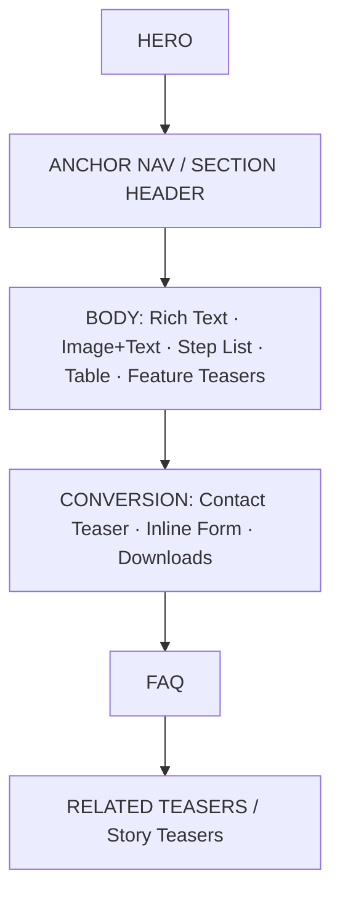
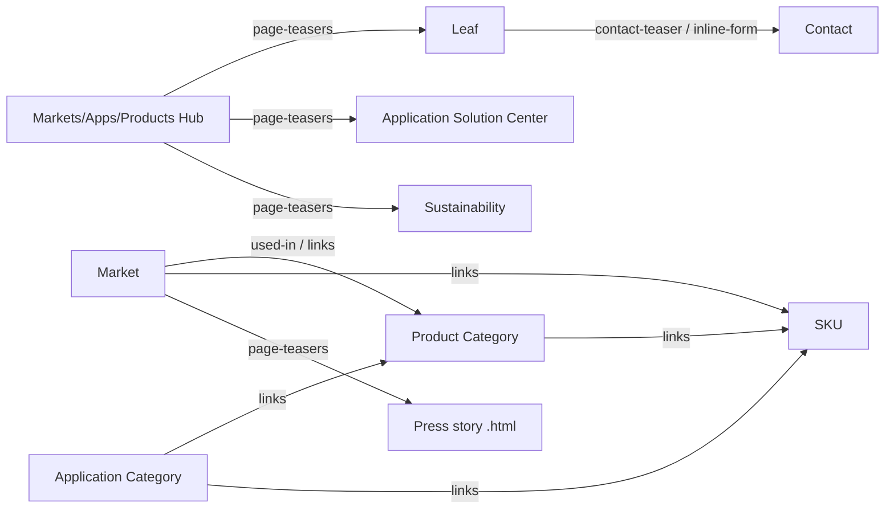

# Tesa Industry — Wireframe Trees

> Reverse-engineered IA wireframes (information structure & module order, not Tesa's copy or code). Every module stack below is taken verbatim from the crawled `moduleSeq` arrays in `research/tesa-ia/data/pages.json`; paths, H1/H2 labels, CTAs and download counts are real. Nothing here is invented — where a template varies between instances, that variance is noted from the actual pages.

---

## How to read these wireframes

Each page type is drawn as a vertical stack of **labelled module boxes**, top to bottom, matching the real `moduleSeq`. The left column shows Tesa's internal module name (the design-system component); the annotation describes what it renders.

**Module library** (the recurring components that make up Tesa's industry design system, with the plain-language label used in the trees):

| Tesa module name | Wireframe label | What it renders |
|---|---|---|
| `static-stage` / `static-activation-stage` / `consumer-stage` | **HERO** | Full-bleed stage: image/title/subtitle; activation variant adds CTA buttons |
| `headline-module` / `blue-headline` | **SECTION HEADER** | Standalone section title (sometimes acts as a CTA band) |
| `anchor-page-navigation` | **ANCHOR NAV** | Sticky in-page jump-nav linking to sections below |
| `card-slider` | **CAROUSEL** | Horizontal card slider ("Select your market") |
| `highlight-teasers` | **FEATURE TEASERS** | Grid of benefit/feature teaser cards |
| `image-article-teasers` / `area-teasers` / `article-gallery-growth` | **STORY TEASERS** | Editorial story/article teaser cards |
| `page-teasers` | **RELATED TEASERS** | "Discover more" cross-section page links |
| `paragraph-2022` / `paragraph` / `sugru-paragraph` | **RICH TEXT** | Rich-text content block |
| `image-with-caption` / `image-text-stacked` / `infotext-image` / `image-map` | **IMAGE+TEXT** | Image paired with copy (map variant = clickable hotspots) |
| `image-gallery` | **GALLERY** | Image gallery |
| `media-opener` | **MEDIA** | Video / media opener |
| `tip-steps` | **STEP LIST** | Numbered tips / step-by-step list |
| `table` | **TABLE** | Comparison/spec table |
| `downloads` | **DOWNLOADS** | Datasheet / brochure download module |
| `inline-form` / `contact-form` | **INLINE FORM** | Embedded contact/lead form |
| `contact-teaser` / `contact-person-teaser` | **CONTACT TEASER** | Contact CTA block (person or generic) |
| `faq` | **FAQ** | FAQ accordion |
| `l-teaser` / `quicklinks` | **QUICKLINKS** | Compact link teasers / quick links |
| `insights-feed` / `highlight-feed` | **FEED** | Press / insights article feed |
| `job-list-filter` | **JOB LIST** | Filterable job listings |
| `insertation` / `insertation-location` | **EMBED** | Embedded asset / office-location map |
| `related-applications` | **RELATED APPS** | Related-application cross-links |
| `marg-t--component` / `divider` / `footnotes` / `coordinator` | *(spacing/util)* | Layout spacers, dividers, footnotes (omitted or shown as `· · ·`) |

**Site shape:** root `/en/industry`; 313 discovered paths; 60 deep-extracted templates. Section hubs at depth 3: `/markets`, `/applications`, `/products`, `/contact-us-industry`, `/application-solution-center`. Sustainability, Press & Insights and Careers live under `/en/about-tesa/*` (corporate, outside `/en/industry`).

---

## 0. Module flow at a glance



Every industry template is a variation on this spine. Hubs front-load **teasers** (navigation); leaf pages front-load **rich text + image** (content) and back-load **conversion** (form/downloads/contact). FAQ and related-teasers are the recurring closers.

---

## 1. Industry Landing / Markets Hub
`/en/industry` (depth 2) · `/en/industry/markets` (depth 3) — **identical template**
H1: "tesa® adhesive solutions for industrial markets"

```
┌─ INDUSTRY LANDING = MARKETS HUB ──────────────────────────────┐
│
├── HERO  (static-activation-stage)
│     └─ stage image + title + activation CTAs
├── CAROUSEL  (card-slider)
│     └─ H2 "Select your market" — cards → 17 market pages
├── FEATURE TEASERS  (highlight-teasers)
│     └─ H2 "Benefits of partnering with us"
├── CONTACT TEASER  (contact-teaser)
│     └─ CTAs: "Find your contact" / "Get in touch"
└── RELATED TEASERS  (page-teasers)
      └─ H2 "Discover more" → Application Solution Center,
         Sustainability, Press stories, contact, feature SKU
```
CTAs: Find out more · Learn more · Find your contact · Get in touch. Downloads: 0. Out-links jump straight into market pages + cross-section (ASC, sustainability, press, a featured product).

---

## 2. Market Page (17 markets, depth 4)
`/en/industry/markets/<market>` — e.g. `automotive`, `electronics`, `appliances`, `battery-energy-storage-systems`, `building-industry`, `metal-industry`, `wind-energy`, `wire-harnessing`, …

This is the **most variable** template — three observable sub-patterns. The canonical "anchor-nav body" pattern dominates; partner/showcase markets diverge.

### 2a. Canonical market (anchor-nav body) — e.g. `automotive`, `battery-energy-storage-systems`, `building-industry`, `food-industry`, `metal-industry`, `server-and-data-centre`, `smart-cards`, `solar-industry`, `wind-energy`, `wire-harnessing`
```
┌─ MARKET (canonical) ──────────────────────────────────────────┐
│
├── HERO  (static-stage)
├── ANCHOR NAV  (anchor-page-navigation)   ← jump to sections
├── RICH TEXT ×n  (paragraph-2022)
│     └─ H2 "Key application areas in the <market>"
├── STEP LIST  (tip-steps)        ← "Our tape solutions for <market>"
│     └─ (or FEATURE TEASERS highlight-teasers ×5 on automotive)
├── · · ·  (marg-t--component)
├── INLINE FORM  (inline-form)    ← H2 "Get in touch" / "Reach out"
├── DOWNLOADS  (downloads)        ← 1–2 assortment PDFs (often present)
├── FAQ  (faq)                    ← present on BESS, building, server
└── CONTACT TEASER / SECTION HEADER  (contact-teaser / headline-module)
```
Notes from crawl: `automotive` repeats **FEATURE TEASERS ×5** (one per application area: EV battery, interior, exterior, car body) and links to focus children + wire-harnessing. `electronics` uses an **IMAGE+TEXT map** (`image-map`) instead of step-list, ends DOWNLOADS → CONTACT TEASER. Download counts: automotive 0, electronics 1, BESS 2, food 1.

### 2b. Showcase market — `appliances`
```
├── HERO (static-stage)
├── SECTION HEADER (headline-module)   ← H2 "For every appliance"
├── IMAGE+TEXT (image-with-caption)
├── FEATURE TEASERS (highlight-teasers) ← H2 "Your goals are our goals"
│                                          (Innovation/Collaboration/Sustainability)
├── SECTION HEADER (headline-module)
├── STORY TEASERS (image-article-teasers)
├── SECTION HEADER (headline-module)   ← "Let's go together"
├── INLINE FORM (inline-form)          ← "Get in touch"
└── DOWNLOADS (downloads ×1)
```
→ links to focus children `/appliances/innovation`, `/collaboration`, `/sustainability`.

### 2c. Partner / hub markets — `distribution-partners`, `industrial-converter-partners`, `paper-print`
```
distribution-partners:  HERO → SECTION HEADER → FEATURE TEASERS →
   STORY TEASERS (article-gallery-growth ×3) → RICH TEXT →
   SECTION HEADER (blue) → RICH TEXT → STORY TEASERS → CONTACT TEASER
industrial-converter-partners:  HERO (consumer-stage) → SECTION HEADER →
   FEATURE TEASERS → RELATED TEASERS → IMAGE+TEXT → CONTACT TEASER →
   RELATED APPS (related-applications) → QUICKLINKS (l-teaser)
paper-print:  HERO → SECTION HEADER → STORY TEASERS (area-teasers ×2) →
   FEATURE TEASERS → RELATED TEASERS → IMAGE+TEXT
```
These behave as **sub-hubs**: more teaser/related modules, no anchor-nav, route deeper into focus topics & partner programs.

---

## 3. Market Focus-Topic (segment children, depth 5+)
`/en/industry/markets/<market>/<focus>` — e.g. `appliances/collaboration`, `appliances/commercial-appliances`. 110 paths live under `/markets`, nesting to depth 8.

```
┌─ MARKET FOCUS-TOPIC ──────────────────────────────────────────┐
│
├── HERO  (static-stage)
├── SECTION HEADER / ANCHOR NAV  (headline-module / anchor-page-navigation)
├── STEP LIST  (tip-steps)         ← benefits / how-it-works
├── IMAGE+TEXT  (image-with-caption / image-text-stacked)
├── RICH TEXT  (paragraph-2022 / paragraph)
├── SECTION HEADER (blue)  (blue-headline)
├── INLINE FORM  (inline-form)
├── DOWNLOADS  (downloads)         ← on collaboration
└── RELATED TEASERS  (page-teasers)
```
Verbatim instances:
- `appliances/collaboration`: HERO → SECTION HEADER → STEP LIST → IMAGE+TEXT → SECTION HEADER → IMAGE+TEXT → RICH TEXT → SECTION HEADER(blue) → INLINE FORM → DOWNLOADS → RELATED TEASERS
- `appliances/commercial-appliances`: HERO → ANCHOR NAV → SECTION HEADER → (RICH TEXT + STEP LIST)×3 → SECTION HEADER → INLINE FORM → RICH TEXT → SECTION HEADER(blue)

Deepest leaves (depth 6) collapse to a minimal stub — e.g. `applications/protection/surface-protection/indoor-usage` & `/outdoor-usage`:
```
HERO (static-activation-stage) → CONTACT TEASER (contact-person-teaser) → · · ·
```

---

## 4. Applications Hub
`/en/industry/applications` (depth 3) · H1 "Adhesives applications for industry"

```
┌─ APPLICATIONS HUB ────────────────────────────────────────────┐
│
├── HERO  (static-stage)
├── ANCHOR NAV  (anchor-page-navigation)
├── SECTION HEADER  (headline-module)
│     └─ H2 "Find the right adhesive tape based on your application"
├── RELATED TEASERS  (page-teasers)   ← cards → 13 application categories
├── RICH TEXT  (paragraph-2022)
├── · · ·  (marg-t--component)
└── CONTACT TEASER  (contact-teaser)  ← CTA "Get in touch"
```
A thin routing hub: teasers fan out to the 13 categories; no downloads.

---

## 5. Application Category (13 categories, depth 4)
`/en/industry/applications/<cat>` — `bonding`, `bundling`, `debonding-on-demand`, `insulation`, `marking`, `masking`, `mounting`, `packaging`, `protection`, `repairing`, `sealing`, `shielding-tapes`, `thermal-management`

Canonical pattern (e.g. `bonding`, `protection`, `marking`):
```
┌─ APPLICATION CATEGORY ────────────────────────────────────────┐
│
├── HERO  (static-stage)
├── ANCHOR NAV  (anchor-page-navigation)
├── RICH TEXT ×n  (paragraph-2022)
│     └─ H2 "Typical <x> applications" / "Overview of our <x> tapes"
├── IMAGE+TEXT  (image-text-stacked)     ← (present on most)
├── · · ·  (marg-t--component)
├── CONTACT TEASER  (contact-teaser)     ← CTA "Contact" / "Get in touch"
└── FAQ  (faq)                           ← H2 "<x>: FAQs"
```
**Heavier variants add conversion modules** (`bundling`, `masking`, `shielding-tapes`, `thermal-management`):
```
… CONTACT TEASER → RICH TEXT → [TABLE → STEP LIST] → FAQ → DOWNLOADS → INLINE FORM
```
Download-rich examples: `masking` (7 PDFs + TABLE + STEP LIST + INLINE FORM), `repairing` (8 PDFs, QUICKLINKS, links to ~35 SKUs), `shielding-tapes` (2 PDFs, links to 11 SKUs), `thermal-management` (3 PDFs). Campaign-style `debonding-on-demand` swaps in MEDIA + STEP LIST + RELATED TEASERS. `packaging` repeats (STEP LIST → TABLE → RELATED TEASERS)×3 and links out to ~10 SKUs.

---

## 6. Application Detail (sub-application, depth 5–6)
`/en/industry/applications/<cat>/<detail>` — e.g. `insulation/damping-tapes`, `protection/surface-protection/...`

```
┌─ APPLICATION DETAIL ──────────────────────────────────────────┐
│
├── HERO  (static-stage / static-activation-stage)
├── ANCHOR NAV  (anchor-page-navigation)
├── RICH TEXT  (paragraph-2022 / sugru-paragraph)
├── IMAGE+TEXT  (image-text-stacked)
├── · · ·  (marg-t--component)
├── CONTACT TEASER  (contact-teaser)
├── STEP LIST  (tip-steps)
├── FAQ  (faq)
└── INLINE FORM  (inline-form)
```
Verbatim `insulation/damping-tapes`: HERO → ANCHOR NAV → RICH TEXT → RICH TEXT → RICH TEXT(sugru) → RICH TEXT → IMAGE+TEXT → CONTACT TEASER → RICH TEXT → STEP LIST → FAQ → INLINE FORM. Depth-6 leaves degrade to the minimal stub (HERO → CONTACT TEASER → spacer) shown in §3.

---

## 7. Products Hub
`/en/industry/products` (depth 3) · H1 "Industrial adhesive products"

```
┌─ PRODUCTS HUB ────────────────────────────────────────────────┐
│
├── HERO  (static-stage)
├── SECTION HEADER  (headline-module)
│     └─ H2 "Your partner for industrial adhesives"
├── RELATED TEASERS  (page-teasers)   ← cards → 25 product categories
│     └─ H2 "Product overview"
├── RICH TEXT  (paragraph-2022)
│     └─ "Find the right adhesive tape type for your application"
├── · · ·  (marg-t--component)
└── CONTACT TEASER  (contact-teaser)  ← CTA "Get in touch"
```
Routing hub like Applications Hub; teasers fan to 25 product categories (anti-slip, cloth, conductive, double-sided, …). Also links to `/products/products-finder` (product-finder tool).

---

## 8. Product Category (25 categories, depth 4)
`/en/industry/products/<cat>` — `aluminium-foil-tapes`, `cloth-tapes`, `double-sided-tapes`, `duct-tapes`, `filament-strapping-tapes`, `filmic-tapes`, `flame-retardant`, `foam-tapes`, `conductive-tape`, `grip-tapes`, `anti-slip-tapes`, …

```
┌─ PRODUCT CATEGORY ────────────────────────────────────────────┐
│
├── HERO  (static-stage)
├── ANCHOR NAV  (anchor-page-navigation)
├── RICH TEXT  (paragraph-2022)
│     └─ H2 "Discover the features"
├── IMAGE+TEXT ×n  (image-text-stacked)   ← "Find the right <x>"
├── RICH TEXT  (paragraph-2022)
├── · · ·  (marg-t--component)
├── CONTACT TEASER  (contact-teaser)
├── DOWNLOADS  (downloads)        ← ~2 PDFs typical (datasheets/folders)
├── FAQ  (faq)                    ← "FAQs about <x>"
└── INLINE FORM  (inline-form)    ← (on download-heavy cats)
```
Observed module mix per category (order from `moduleSeq`):
| Category | Closers present |
|---|---|
| `aluminium-foil-tapes` | CONTACT TEASER · FAQ · DOWNLOADS · INLINE FORM |
| `cloth-tapes` | CONTACT TEASER · DOWNLOADS · FEATURE TEASERS |
| `conductive-tape` | FEATURE TEASERS ×2 · CONTACT TEASER |
| `double-sided-tapes` | CONTACT TEASER · FAQ |
| `duct-tapes` | CONTACT TEASER · FEATURE TEASERS · FAQ |
| `filament-strapping-tapes` | DOWNLOADS · FAQ · INLINE FORM |
| `filmic-tapes` | DOWNLOADS · FAQ · INLINE FORM |
| `flame-retardant` | STEP LIST · TABLE · CONTACT TEASER · FAQ · DOWNLOADS ×2 |
| `foam-tapes` | CONTACT TEASER · FEATURE TEASERS · footnotes |
| `grip-tapes` | GALLERY · CONTACT TEASER · DOWNLOADS · FAQ |
| `anti-slip-tapes` | (long rich-text + IMAGE+TEXT only) |

CTAs: Downloads · Contact. Categories link down to individual SKU pages ("used-in").

Some categories have detail children (depth 5), e.g. `double-sided-tapes/team-4965-assortment`, `foam-tapes/acrylic-foam-tapes` — these render like a hybrid SKU/category page (HERO `static-activation-stage` → ANCHOR NAV → RICH TEXT → MEDIA/EMBED → DOWNLOADS → RELATED TEASERS).

---

## 9. Product Detail (SKU page)
Flat namespace: `/en/industry/<sku>.html` — **134 SKU pages** (e.g. `tesa-4965.html`, `tesa-flamextinct-45001.html`, `tesa-60408-bio-based-paper-packaging-tape.html`). Template inferred from the deep-extracted assortment leaf `products/double-sided-tapes/team-4965-assortment` + SKU link patterns.

```
┌─ PRODUCT DETAIL / SKU ────────────────────────────────────────┐
│
├── HERO  (static-activation-stage)   ← product name + key claim + CTAs
├── ANCHOR NAV  (anchor-page-navigation)
├── RICH TEXT  (paragraph-2022)       ← specs / technical properties
├── EMBED  (insertation)              ← (optional)
├── MEDIA  (media-opener)             ← product video
├── RICH TEXT  (paragraph)
├── · · ·  (marg-t--component)
├── DOWNLOADS  (downloads)            ← datasheet / TDS PDFs
└── RELATED TEASERS  (page-teasers)   ← related products / used-in
```
SKUs are leaf nodes referenced *from* application categories, market pages and product categories (the "used-in" graph). Downloads (datasheets) are the defining module — there is no separate Resources section; downloads are embedded here.

---

## 10. Sustainability (corporate)
`/en/about-tesa/sustainability` (depth 3) · H1 "Not promises, proven progress."

```
┌─ SUSTAINABILITY ──────────────────────────────────────────────┐
│
├── HERO  (static-stage)
├── SECTION HEADER  (headline-module)
├── RICH TEXT  (paragraph)
├── SECTION HEADER  (headline-module)
├── RICH TEXT  (paragraph)
├── CAROUSEL  (card-slider)        ← "Strategic action areas"
├── SECTION HEADER  (headline-module)
├── RELATED TEASERS  (page-teasers)
├── QUICKLINKS  (l-teaser)
├── SECTION HEADER  (headline-module)
├── · · ·  (marg-t--component)
└── STORY STAGES ×3  (static-activation-stage ×3)  ← story showcases
```
Closes with three full activation stages (story showcases). Lives outside `/en/industry`.

---

## 11. Press & Insights (corporate)
`/en/about-tesa/press-insights` (depth 3) · H1 "Press & Insights"

```
┌─ PRESS & INSIGHTS ────────────────────────────────────────────┐
│
├── FEED  (highlight-feed)     ← featured press, top of page
├── FEED  (insights-feed)      ← Insights articles
├── STORY TEASERS  (area-teasers)   ← "Most read" / "tesa tape heroes"
├── FEED  (insights-feed)
└── STORY TEASERS  (area-teasers)
```
Pure feed page — no hero stage, no form. Feeds are the "knowledge/insights" surface; story articles (`/press-insights/stories/*.html`) are linked from market & application pages throughout the site.

---

## 12. Careers (corporate)
`/en/about-tesa/career` (depth 3) · H1 "A place for you"

```
┌─ CAREERS ─────────────────────────────────────────────────────┐
│
├── HERO  (static-stage)
├── QUICKLINKS  (quicklinks)
├── JOB LIST  (job-list-filter)    ← filterable open positions
├── SECTION HEADER  (headline-module)
├── RICH TEXT  (paragraph)         ← values
├── SECTION HEADER  (headline-module)
├── RICH TEXT  (paragraph)
├── SECTION HEADER  (headline-module)
├── MEDIA  (media-opener)          ← culture video
├── SECTION HEADER  (headline-module)
├── RELATED TEASERS  (page-teasers)
├── STORY TEASERS  (area-teasers)
└── FAQ  (faq)                     ← application FAQ
```

---

## 13. Contact
`/en/industry/contact-us-industry` (depth 3) · H1 "Get in touch with us"

```
┌─ CONTACT ─────────────────────────────────────────────────────┐
│
├── SECTION HEADER  (headline-module)   ← (no hero stage)
├── INLINE FORM  (inline-form)
├── SECTION HEADER  (headline-module)
│     └─ H2 "Our direct contact information"
├── OFFICE MAP  (insertation-location)  ← locations/offices embed
├── SECTION HEADER  (headline-module)
└── RELATED TEASERS  (page-teasers)
      └─ H2 "You might also be interested in" → finder, sustainability, press
```
Form-first page. The product-finder, sustainability and press are surfaced as related teasers. (Paper/print has its own contact variant `/paper-print/contact-us-print-paper-industry`: HERO `static-activation-stage` → `contact-form` only.)

---

## 14. Application Solution Center (Customer Solution Center)
`/en/industry/application-solution-center` (depth 3) · H1 "Customer Solution Center"

```
┌─ APPLICATION SOLUTION CENTER ─────────────────────────────────┐
│
├── HERO  (static-activation-stage)
├── EMBED  (insertation)
├── GALLERY  (image-gallery)
├── EMBED  (insertation)
├── IMAGE+TEXT  (infotext-image)   ← Service 1: Product Recommendation
├── IMAGE+TEXT  (infotext-image)   ← Service 2: Certification
├── IMAGE+TEXT  (infotext-image)   ← Service 3: On-site Support
├── IMAGE+TEXT  (infotext-image)   ← Service 4: Training
├── IMAGE+TEXT  (infotext-image)   ← Service 5: Application Process Engineering
└── RICH TEXT  (paragraph-2022)    ← "Reach Out to Our Tape Experts!"
```
Five `infotext-image` blocks = the five named services. A service-showcase page, no form/FAQ.

---

## Cross-page wiring (relationship signals)

`page-teasers` and `contact-teaser` carry the cross-section links; `links[]` in pages.json shows the actual graph:



- **Markets ↔ Applications ↔ Products ↔ SKUs** are woven via in-body links, not a separate taxonomy page. E.g. `applications/mounting` links to 6 product categories + transportation/building/automotive markets + 4 press stories; `applications/repairing` links to ~35 SKUs; `markets/battery-energy-storage-systems` links to 8 SKUs.
- **No dedicated "Technologies" or "Resources/Downloads" top-level section.** "Technologies" are implicit in product categories / adhesive types; "downloads/resources" are the **DOWNLOADS module** embedded on product, market, application and SKU pages; "insights/knowledge" = the Press & Insights **FEED** surface + `stories/*.html` cross-linked from leaves.
- **Conversion is everywhere:** `contact-teaser` (hubs, categories) and `inline-form` (leaves, markets) both route to `/contact-us-industry`.

---

## Template → module-count cheat sheet

| Template | Typical module stack length | Signature closers | Downloads |
|---|---|---|---|
| Industry Landing / Markets Hub | 5 | contact-teaser → page-teasers | 0 |
| Market (canonical) | 10–14 | inline-form → downloads → faq | 0–2 |
| Market (showcase/partner) | 8–10 | story/feature teasers → contact-teaser | 0–1 |
| Market Focus-Topic | 8–14 (stub: 3) | inline-form → downloads → page-teasers | 0–1 |
| Applications Hub | 7 | page-teasers → contact-teaser | 0 |
| Application Category | 6–14 | contact-teaser → faq (+downloads/form) | 0–8 |
| Application Detail | 6–13 (stub: 3) | faq → inline-form | 0–1 |
| Products Hub | 6 | page-teasers → contact-teaser | 0 |
| Product Category | 9–14 | contact-teaser → faq → downloads → inline-form | ~2 |
| Product Detail / SKU | ~10 | downloads → page-teasers | 1+ (datasheets) |
| Sustainability | 14 | 3× story stages | 0 |
| Press & Insights | 5 | feeds + area-teasers | 0 |
| Careers | 13 | page-teasers → area-teasers → faq | 0 |
| Contact | 6 | insertation-location → page-teasers | 0 |
| Application Solution Center | 10 | 5× infotext-image → paragraph | 0 |
```
